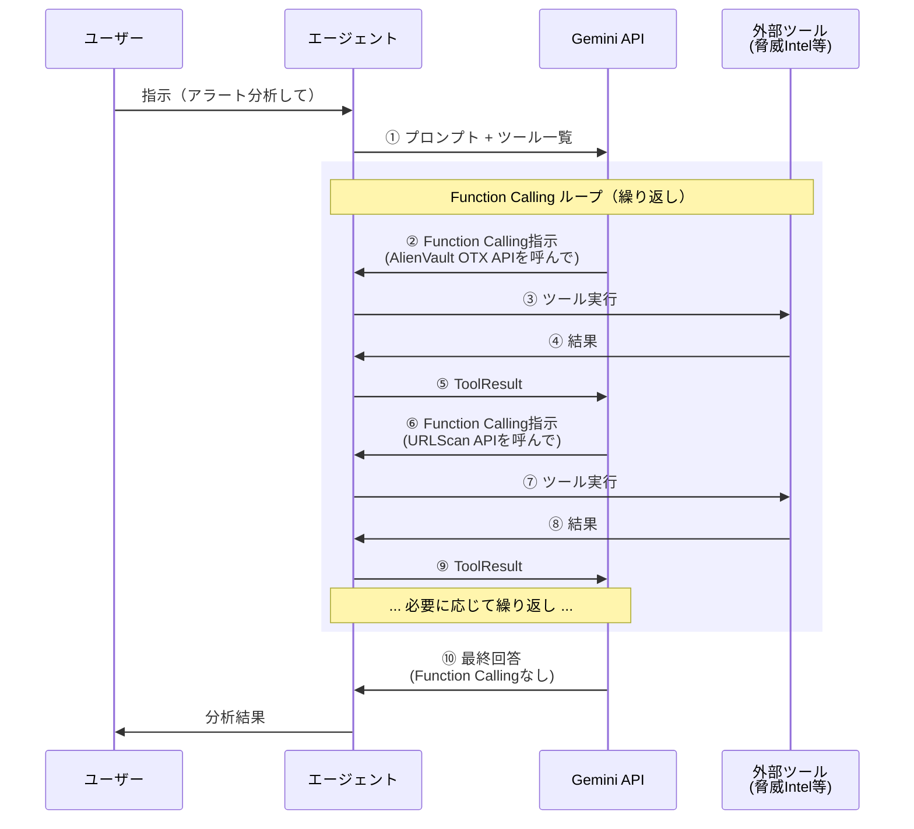

この記事はアドベントカレンダー「Goで作るセキュリティ分析生成AIエージェント」の8日目です。今回は生成AIエージェントがもつ重要な機能の1つである、外部ツール連携についての基礎を説明します。今回のコードは https://github.com/m-mizutani/leveret の [day08-function-calling](https://github.com/m-mizutani/leveret/tree/day08-function-calling) ブランチに格納されていますので適宜参照してください。


# Function Callingとは

## 概要

- 生成AIの応答時に「外部ツール呼び出し」の応答をもたせること
  - Function CallingはOpenAI・Googleの呼び名
  - 他にはTool Use、Tool Callingなどとも呼ばれる
  - いずれも明確に外部ツールの呼び出しを制御するための技術
- 外部ツール呼び出しとは、なんらかの機能を提供すること
  - プログラミング的に言えば、関数を提供するのに等しい
  - 生成AIの機能を拡張させる
- どのような関数でもよい
  - ランタイムの内部で完結するタイプ
    - 複雑な計算
    - ランタイム内にもつデータ処理（読込、書き込み）
  - ランタイム外部にアクセスするタイプ
    - 外部データベースの参照や変更
    - 外部サービス（SaaS）などの利用
- 基本は GenerateContent の応答に、テキストではなく特殊なFunction Callingという応答（GeminiでいうとParts）が存在する
  - これを受け取ったら実際に外部ツールを呼び出し、その後応答をさらにGenerateContentの入力として渡す
  - 多くの場合、Function Callingが無くなるまでこれを繰り返す
  - 最終的にテキストなどの応答をユーザ側に返す
  - このフローは様々な発展形があるが、まずは最もシンプルな構成を今回とりあつかう

イメージ再掲



## なぜFunction Callingが必要か

- 大きく分けて4つほど理由がある
- ただしこれらはFunction Callingに頼りすぎず、生成AI呼び出しのワークフロー（コード内）でやる方が良いユースケースも多い
- コレについてはケースバイケースで、ちゃんと判断する必要がある
- Function Callingは強力だが、過度にそれに頼るのも良くない。コードによるワークフロー制御内でうまく外部サービスと連携するのも考えるべき

### 必要に応じたデータの読込

1. 生成AIの処理において事前にどのようなデータが必要かわからないとき
    - コンテキストウィンドウの都合で全部のデータを与えておくわけにはいかない
    - ユーザの指示などに応じて必要なデータを選択する必要がある
    - ツールを使って選択的にコンテキストへデータを挿入できる
    - ただしこれについては生成
2. データの取り出しに制限がある場合
    - コンテキストウィンドウに収まるとしてもデータ呼び出しにコストが掛かかるなどで全部取得できない場合がある
    - 例えば外部サービスのAPI呼び出しにrate limitがかかっている場合や、取得回数に応じて課金が発生する仕組みなど
    - 必要最低限のデータ読込をするために生成AIに判断させる

### 複雑・特殊な処理が必要な場合

- 生成AIはどのような処理でもできそうに見えて、2025年現在では苦手な処理も多い
  - 正確な数式処理、数値計算、統計
  - 特殊なアルゴリズムに基づく処理：クラスタリング、最適化問題などなど
  - 大容量データにたいする処理
- これを外部ツールに移譲することで、より正確な処理などが可能になる

### 外部データストアの書き換えや干渉が必要な場合

- データベースの書き換えのようなプリミティブな処理だけでなく、外部SaaSのデータ作成や変更など
- 例えば結果の出力
  - ドキュメントの生成
  - チケットの作成
  - データの整理
- 通知など
- 生成AIの外部という意味ではローカルのファイル操作などもこれに該当
  - 生成AIのコーディングエージェントでよくやる
  - コマンド呼び出しとかもね

# Function Callingの構造

- 先述した通り、function callingには専用のフォーマットがある
- 各生成AIプロバイダごとに違うがSDKに従えばOK
  - ただし、概念は同じだが細かい制約や入力値などは結構違うので注意

## 生成AIサービスでの呼び出し方

- Geminiのコードをみていく
- まずは[Function Declaration](https://github.com/googleapis/go-genai/blob/v1.32.0/types.go#L1287-L1321)
  - 下記は説明に必要なフィールドのみ抽出。詳細は本体のコードを見て

```go
type FunctionDeclaration struct {
	Description string `json:"description,omitempty"`

    Name string `json:"name,omitempty"`

    Parameters *Schema `json:"parameters,omitempty"`
}
```

- これを外部ツールの定義としてGenerateContent時に渡してあげる必要がある
- 重要なのは `Name`, `Description`, そして `Parameters`
  - `Name`: 外部ツールのID。まずこれがどれくらいその外部ツールの適切に表現した名前かどうかで、生成AIがそれをうまく選択し、使ってくれるかが大きく変わる
    - 注意点として生成AIに複数ツールを渡す場合はユニークな名前にする必要がある
    - さらに使える文字種に制限があるので注意
  - `Description`: Optional扱いになっているが絶対ちゃんと書いたほうがいい。Nameについでそのツールの機能や責務などを明確化することで、生成AIからちゃんと使われるかどうかに関わる
  - `Parameter`: JSONスキーマのように定義する方法
    - これもしっかり定義する必要がある
    - あまり謎な構造にすると生成AIが解釈できない。なるべく "一般的" な引数名や役割にしてあげることが重要
    - このDescriptionも重要。どのような入力を許容するかとか、実際の引数のサンプルを提示したりなどがあるとスムーズに利用される

- [Function Call](https://github.com/googleapis/go-genai/blob/v1.32.0/types.go#L827-L837) これが返ってくる

```go
type FunctionCall struct {
	// Optional. The unique ID of the function call. If populated, the client to execute
	// the
	// `function_call` and return the response with the matching `id`.
	ID string `json:"id,omitempty"`
	// Optional. The function parameters and values in JSON object format. See [FunctionDeclaration.parameters]
	// for parameter details.
	Args map[string]any `json:"args,omitempty"`
	// Required. The name of the function to call. Matches [FunctionDeclaration.Name].
	Name string `json:"name,omitempty"`
}
```

- これがTextの代わりに帰ってきたらそのツールを呼び出す
- `ID` はGemini側が採番したID。もしあったらこれを付与して応答を返す
- `Name`: これはこちらが定義したツール名

## 生成AIからの応答を構造化する方法と何が違うのか

- 本質的にはあまり違わない
  - 実際、Function Callingという概念がちゃんと確立する2023年前半くらいまではJSONの応答をそのまま使っていた
  - 実際には
- Function Callingを使うメリット
  - 細かに指示を出さなくても指定したフォーマットが返ってくる
    - やっているとわかるが、これに関して細かな指示をだすのは結構面倒なのでそこを担保してくれるのは一定楽
  - 「ツール呼び出し指示とその応答」というのもサービス側が勝手に解釈してくれるのでいちいち指示を出さないでよいのは楽
- デメリットと言うか使わない場合
  - 単純な外部ツール呼び出しだけじゃないパターン。例えばワークフローに分岐を入れたかったり、行動制御を伴うものなど
  - このあたりはまだベストプラクティスが固まりきっていないと思う。

# ツールの実装（アラート検索ツール）

- 実際にツールを実装してみる
- まずもっとも簡単な例としてアラートを自由に検索できるツールを実装する
- firestoreの制約を踏まえて簡単に実装するために単一フィールドを対象とした検索とする

## ツールの仕様整理

順番に進めたいので、まず仕様を整理する

- アラートのデータベースから特定の条件に合致するアラートを検索したい
- 元のアラートデータ（JSON）の任意のフィールドを検索対象にしたい
- GuardDutyであれば `Type` や `Severity`、ネストしたフィールドであれば `Service.Action.ActionType` のようなパスで指定したい
- 比較演算子（等号、不等号、範囲など）を使って柔軟な条件指定をしたい
- 検索結果は人間が読みやすい形式で取得したい
- 大量の結果がある場合はページネーションで取得したい

## ツール定義

上記の要求と制約を踏まえ、アラート検索ツールを以下のように定義します：

- **Name**: `search_alert`
- **Description**: `Search alerts by querying fields in the original alert data. Field paths are automatically prefixed with "Data."`

- もっといろんなツールがある場合はよく詳細な名前にしても良いが、これでもワークする
- Descriptionには、このツールは何をして何が得られるのかがわかるようにしておくとよい
- そしてパラメータは以下のようになる

| パラメータ名 | 型 | 必須 | 説明 | 制約・備考 |
|------------|-----|------|------|-----------|
| `field` | string | ○ | 検索対象のフィールドパス（ドット記法）<br/>例: `"Type"`, `"Severity"`, `"Service.Action.ActionType"` | `Data.`プレフィックスは自動付与 |
| `operator` | string | ○ | 比較演算子 | `==`, `!=`, `<`, `<=`, `>`, `>=`, `array-contains`, `array-contains-any`, `in`, `not-in` のいずれか |
| `value` | string | ○ | 比較する値 | - |
| `value_type` | string | - | 値の型 | `string`（デフォルト）, `number`, `boolean`, `array` のいずれか |
| `limit` | integer | - | 最大取得件数 | デフォルト: 10, 最大: 100 |
| `offset` | integer | - | ページネーション用オフセット | デフォルト: 0 |

- このコードを実際にコードにするとこうなる

```go:pkg/tool/alert/search.go
// NewSearchAlerts creates a new search_alerts tool
func NewSearchAlerts(repo repository.Repository) *searchAlerts {
	return &searchAlerts{
		repo: repo,
	}
}
```

- 今回は `pkg/tool/alert/search.go` にこの機能を実装する
- アラートの検索はレポジトリからするので、 `repository.Repository` インターフェイスを渡す
- 本来は以下定義もstaticでいいんだけど、たまにツールの状態によって呼び出しフィールドや説明を変更する必要のあるものもあるので、 `struct` でメソッドをていきょうするかたちにしている
- これは後日更に拡張していく

```go:pkg/tool/alert/search.go
// FunctionDeclaration returns the function declaration for Gemini API
func (s *SearchAlerts) FunctionDeclaration() *genai.FunctionDeclaration {
	return &genai.FunctionDeclaration{
		Name:        "search_alerts",
		Description: `Search alerts by querying fields in the original alert data. Field paths are automatically prefixed with "Data."`,
		Parameters: &genai.Schema{
			Type: genai.TypeObject,
			Properties: map[string]*genai.Schema{
				"field": {
					Type:        genai.TypeString,
					Description: `Field path in alert data (auto-prefixed with "Data."). Use dot notation for nested fields. The field path must exactly match the structure in the Data field of the alert. Examples: "Type", "Severity", "Service.Action.ActionType", "Resource.InstanceDetails.InstanceId"`,
				},
				"operator": {
					Type:        genai.TypeString,
					Description: "Firestore comparison operator",
					Enum:        []string{"==", "!=", "<", "<=", ">", ">=", "array-contains", "array-contains-any", "in", "not-in"},
				},
				"value": {
					Type:        genai.TypeString,
					Description: "Value to compare",
				},
				"value_type": {
					Type:        genai.TypeString,
					Description: "Type of the value (default: string)",
					Enum:        []string{"string", "number", "boolean", "array"},
				},
				"limit": {
					Type:        genai.TypeInteger,
					Description: "Max results (default: 10, max: 100)",
				},
				"offset": {
					Type:        genai.TypeInteger,
					Description: "Skip count for pagination (default: 0)",
				},
			},
			Required: []string{"field", "operator", "value"},
		},
	}
}
```

少し解説する
- `field` はどういう値が入るかを細かく説明する必要がある。今回はパスを入力しないといけないが、生成AIがパスをどのように認識するかはブレがある。例えばネスト冴えれたフィールドの最後のフィールド名だけで指定されるのを勝手に想像するとか（実際そういうシステムもある）なので何ができて何が駄目かみたいなのをちゃんと説明する
- `operator` は種類が限定されている。こういうときはちゃんとEnumで指定可能な値を限定させる
- `value` はstringにしているが、実際は数値だったりbooleanだったりする。本来のシステムならtimestampとかもある（今回はない）
- そこで `value_type` というのを用意し、型を指定させる。これもEnumで種類を縛る（そうでないと好き買って入力される）
- `limit` や `offset` はそのままだが、一般的なAPI呼び出しで使われる名前にしておくことで生成AIの理解を得やすくする

# ツール実行ループと制御

## ツール定義の設定

- 今回はsearch alertのみを対象とする
- 事前にSessionオブジェクトの中にsearchAlertを仕込んでおく
- searchAlertが存在したら、このようにGenerateContentのconfigに入れ込む
- これによって定義が生成AI側に伝わる

```go
// Add tool if available
if s.searchAlert != nil {
    config.Tools = []*genai.Tool{{
        FunctionDeclarations: []*genai.FunctionDeclaration{
            s.searchAlert.FunctionDeclaration(),
        },
    }}
}
```

## 複数回のツール呼び出し

- ツール呼び出しは一度で終わるとは限らない
- そのため何度かループをかけるようにする
- `hasFunctionCall` ではFunctionCallingの命令がないかを確認し、もしなければそのままループをぬける
- 無限実行を防ぐため、max iterationのようなサーキットブレーカーを用意しておく必要がある

```go:pkg/usecase/chat/session.go
	// Tool Call loop: keep generating until no more function calls
	const maxIterations = 10
	var finalResp *genai.GenerateContentResponse

	for i := 0; i < maxIterations; i++ {
		resp, err := s.gemini.GenerateContent(ctx, s.history.Contents, config)
		if err != nil {
			return nil, goerr.Wrap(err, "failed to generate content")
		}

		finalResp = resp

		// Check if response contains function calls
		if !hasFunctionCall(resp) {
			// No function call, this is the final response
			if len(resp.Candidates) > 0 && resp.Candidates[0].Content != nil {
				s.history.Contents = append(s.history.Contents, resp.Candidates[0].Content)
			}
			break
		}
```

## エラーハンドリング

- ツールはなんらかの一時的な事情（例えば一時的な通信環境の悪化）などで失敗するケースも有る
- 一般的にはエラーが起きたらすぐ中断するみたいなことがあるが、エージェント的動作ではそのエラーをどう捌くかも生成AIに判定させる
- 方法としてはエラーが帰ってきたらそのエラーを結果としてそのまま伝える
- その結果をもとに次の行動を決めさせる
- ただし無限ループされると困るので、max iteration、あるいはエラーリトライの上限のような仕組みでサーキットブレーカーを用意しておく

```go
// Execute the tool
result, err := s.executeTool(ctx, funcCall)
if err != nil {
    result = "Error: " + err.Error()
}

// Add function response to history
funcResp := &genai.FunctionResponse{
    Name:     funcCall.Name,
    Response: map[string]any{"result": result},
}
funcRespContent := &genai.Content{
    Role:  genai.RoleUser,
    Parts: []*genai.Part{{FunctionResponse: funcResp}},
}
s.history.Contents = append(s.history.Contents, funcRespContent)
```

## 実行例

- これを実際に動かしていみるとこういう感じになる
- 今回はデータ構造をシンプルにしたかったのでalert newするときに `examples/alert/guardduty-finding.json` を使った。詳しくはGitHubを参照

```shell
zenv go run . chat -i baa7823c-7ea2-4352-a06b-bda92a53103a

Chat session started. Type 'exit' to quit.

> このアラートと似たようなアラートを探して

⠼ searching...
🔧 Calling tool: search_alerts
   value: Trojan:EC2/DropPoint!DNS
   field: Type
   operator: ==
✅ Tool result:
Found 2 alert(s):

1. ID: abff9f2d-d38c-4710-8801-c18fb2c68173
   Title: EC2 Instance Queries Malicious DropPoint Domain
   Created: 2025-10-26 01:38:24
   Description: An EC2 instance has initiated a...

このアラートと類似したアラートを2件見つけました。

1. **ID**: abff9f2d-d38c-4710-8801-c18fb2c68173
   **タイトル**: EC2 Instance Queries Malicious DropPoint Domain
   **説明**: EC2インスタンスが、マルウェア操作に関連し、特に盗まれた認証情報やデータのドロップポイントとして知られているドメインへのDNSリクエストを開始しました。この活動は、EC2インスタンスが侵害されている可能性を示しており、潜在的なデータ流出やコマンド＆コントロール通信の試みを示唆しています。脅威を封じ込め、さらなる影響を防ぐために、直ちに調査が必要です。

2. **ID**: baa7823c-7ea2-4352-a06b-bda92a53103a
   **タイトル**: EC2 instance queried known malware drop point domain
   **説明**: EC2インスタンスが、マルウェアの既知のドロップポイントであり、盗まれた認証情報のホストとして識別されているドメイン「3322.org」へのDNSリクエストを開始しました。この活動は、EC2インスタンスが侵害されている可能性があり、コマンド＆コントロール通信またはデータ流出に関与している可能性を示唆しています。脅威を封じ込めるために、直ちの調査が必要です。
```

# まとめ
