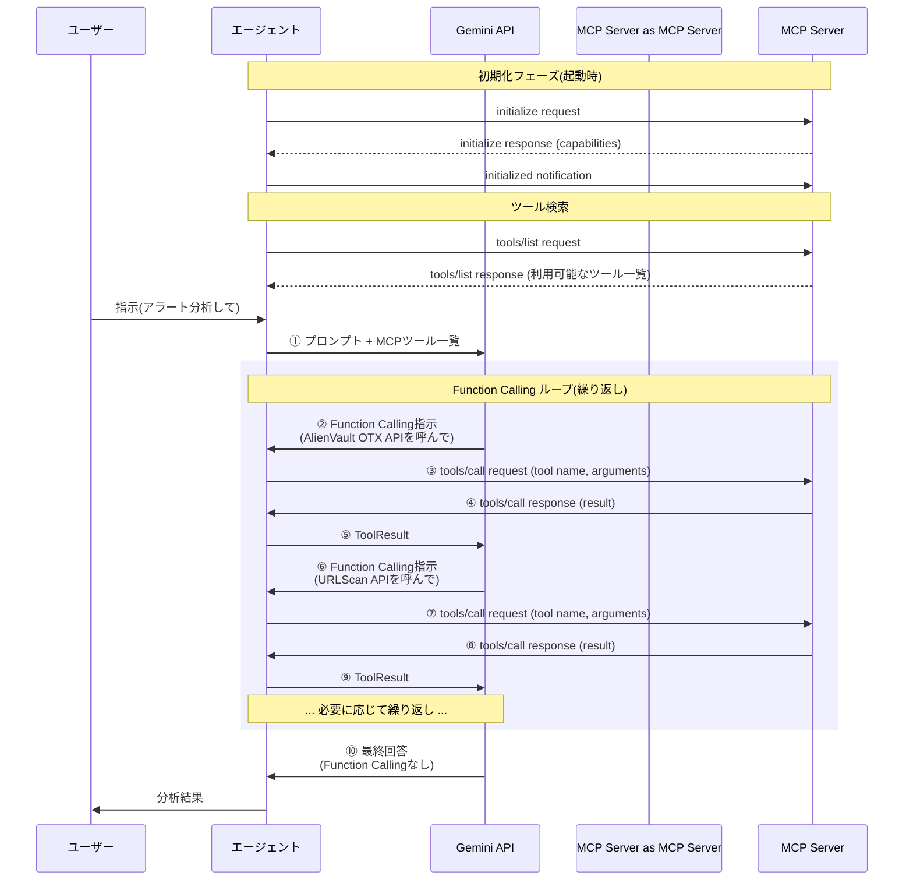

この記事はアドベントカレンダー「Goで作るセキュリティ分析生成AIエージェント」の10日目です。今回は Model Context Protocol (MCP) を使ってツール呼び出し機能を別プロセスや別サービスへ移譲する方法についてです。エージェントとしてはMCPを利用する機能だけ実装すれば良いですが、理解のために今回はクライアントについても実装します。

今回のコードは https://github.com/m-mizutani/leveret の [day10-mcp](https://github.com/m-mizutani/leveret/tree/day10-mcp) ブランチに格納されていますので適宜参照してください。

# Model Context Protocol (MCP) とは

- Anthropicが考案したAIアプリケーション間のインターフェースとなるプロトコル（open-source standard for connecting AI applications to external systems）
  - 詳しくは公式ページ参照 https://modelcontextprotocol.io
- 要するに前回までにやってきたツール呼び出し（Function Calling）をプロセス外にまで拡張できるようにしたRPC（Remote Procedure Call）の一種
  - 部分的に生成AI特有の機能はあるが、メインはシンプルなRPCでありあまりAI関係ない

## プロトコルの概要

- 詳しくは公式ページを見るて
  - 説明の詳細さ・正確性の問題だけでなく仕様が勢いよく更新されるから
- ここでは本当に概要というか概念だけ説明
- Serverがツールを提供し、それにClientが接続してツールを呼び出すという関係
- Serverっていうとリモートに存在することをイメージするかも知れないが、基本的にはtransport層（接続方法）に Streamable HTTPとstdio（プロセス起動して標準入出力で遣り取りをするもの）の2種類が存在する
  - Streamable HTTP はネットワーク越しにつなげることも可能
  - stdio はローカル限定
  - もともとはlanguage serverに着想を得た仕組み
    - なので当初はローカル起動前提だったが、仕様がバージョンアップされるごとにリモート接続の機能が強化されていった
- なるべくわかりやすいよう、これまでのFunction Callingのを拡張する形で図解
- まず起動時にMCPサーバに接続する（stdioなら起動、Streamable HTTP ならセッション確立）



## なぜMCPが必要か？

- 標準化することによるメリットはある

### ツール実装の分離と再利用性

- これまでの実装ではツールはエージェント本体に組み込まれていた
- MCPを使うことでツール実装を別プロセス・別リポジトリに分離できる
- 同じツールを複数のエージェントから利用可能に
- 同じような機能であれば、共通化したインターフェースで再配布・再利用が可能になる

### エコシステムの活用

- 既存のMCPサーバーをそのまま利用できる
- コミュニティが開発したツールを簡単に組み込める
- 自作ツールも他のMCP対応アプリケーションから使える

### 開発・保守の効率化

- エージェント本体とツールを独立して開発・更新できる
- ツールの言語やフレームワークを自由に選択可能（Go、Python、TypeScriptなど）
- 既存のライブラリやツールをMCPサーバーとしてラップするだけで利用可能

## MCP利用における課題

- 一方で色々課題もある

### 認証認可

- OAuthのリソースサーバとして利用するという規格はすでにある
  - 例えばGitHubのリソースを触るMCPなら、GitHub側で認証したのちにトークンをMCP側に引き渡すことで、その認証をしたユーザの権限のみでアクセスさせるということはできる
  - DCR（dynamic client registration）やaudienceの指定もできるようになっている。むしろaudienceの指定はMUSTとされている
  - しかし実際には実装がまだ普及していないという指摘もある（ [](https://blog.christianposta.com/understanding-mcp-authorization-with-dynamic-client-registration/?utm_source=chatgpt.com)）
- また、このモデルはMCPクライアントがユーザのローカル環境＆MCPサーバが3rd party提供などというアーキテクチャが想定されている
  - 例えば共用としてクラウド上で動作するAIエージェントの場合、このモデルがうまく機能しない場合もある
- 認証認可周りはおそらく今後もアップデートが続くと思われるので、注視するべき

### 3rd party MCP利用の安全性

- 当然だが3rd party MCPの利用はいろいろリスクがある
- MCPに渡した権限の範囲でなんでもできています
- またMCPからエージェントに返される応答の中に悪意あるプロンプトを混ぜるような攻撃もある
- そのためエコシステムを活用するのは慎重になる必要がある

# MCPクライアントの実装

- 実際にMCPクライアントをエージェントに組み込んでみる
- 基本的には公式のGo SDKを使うのがよい
  - github.com/modelcontextprotocol/go-sdk/mcp
  - 公式SDKはあくまで接続やMCP間でのプロトコルを担保してくれるだけなので、利用するMCPサーバの管理などはアプリケーション側で実装する必要がある

## 設定ファイル

- MCPは複数利用することがある
- そのためCLIのフラグなどで設定値を表現するのが面倒
- ゆえに設定ファイルを作る
  - yaml形式
  - server定義以外も扱うかもなので `servers` というセクションに記載する
  - 名前は管理目的
  - transportによって通信方法を決定
  - stdioならコマンド実行になるので、 `command` でどういうコマンドを実行するか指定する
- これを起動時に読み込むようにする

```yaml
servers:
  # Filesystem MCP server - allows reading and searching files
  # Install: npm install -g @modelcontextprotocol/server-filesystem
  - name: filesystem
    transport: stdio
    command:
      - npx
      - -y
      - "@modelcontextprotocol/server-filesystem"
      - /tmp
    env:
      NODE_ENV: production
```

## MCPサービス

- 今回はmcp機能をまるっと pkg/service/mcp 内にまとめることにする
- MCP自体は先述した通りあくまでRPCのプロトコルで、呼び出しの方法はFunction Callingと同じ
- そのためMCPとFunction Callingを仲介する機能が必要であり、それが pkg/service/mcp になっている
- `LoadAndConnect` という関数を用意してまず初期化（設定ファイルの読込とMCPサーバとの接続、Tool化）をまとめてやる
  - 先述した通りMCPサーバとはコネクションを貼りっぱなしにするので一括で処理する
- `Provider` がMCPサーバとの間を取り持って、エージェントにツールとして見せるという仲介役を担っている

```go:pkg/service/mcp/client.go
// LoadAndConnect loads MCP configuration from file and connects to all servers
// Returns a tool.Tool provider if successful, nil if no config or connection fails
func LoadAndConnect(ctx context.Context, configPath string) (*Provider, error) {
	if configPath == "" {
		return nil, nil // MCP config not specified
	}

	// Get absolute path of config file
	absConfigPath, err := getAbsPath(configPath)
	if err != nil {
		return nil, goerr.Wrap(err, "failed to resolve config path",
			goerr.V("path", configPath))
	}

	// Load config file
	data, err := os.ReadFile(absConfigPath)
	if err != nil {
		return nil, goerr.Wrap(err, "failed to read MCP config file",
			goerr.V("path", absConfigPath))
	}

	var cfg Config
	if err := yaml.Unmarshal(data, &cfg); err != nil {
		return nil, goerr.Wrap(err, "failed to parse MCP config file",
			goerr.V("path", absConfigPath))
	}

	if len(cfg.Servers) == 0 {
		fmt.Println("No MCP servers configured")
		return nil, nil // No servers configured
	}

	// Create client and connect to all servers
	client := newClient()
	var connectedServers []string
	var failedServers []string

	for _, serverCfg := range cfg.Servers {
		if err := client.Connect(ctx, serverCfg); err != nil {
			fmt.Printf("Warning: failed to connect to MCP server '%s': %v\n", serverCfg.Name, err)
			failedServers = append(failedServers, serverCfg.Name)
			continue
		}
		fmt.Printf("Connected to MCP server: %s\n", serverCfg.Name)
		connectedServers = append(connectedServers, serverCfg.Name)
	}

	// Return provider if any server connected, otherwise just warn
	if len(connectedServers) == 0 {
		fmt.Printf("Warning: no MCP servers connected (%d failed)\n", len(failedServers))
		return nil, nil // Don't fail, just skip MCP
	}

	return NewProvider(client), nil
}
```

- CLIでは設定ファイルのパスだけ受け取るようにする

```go:pkg/cli/config.go
// mcpConfig holds MCP-specific configuration
type mcpConfig struct {
	configPath string
}

// mcpFlags returns flags for MCP-related configuration with destination config
func mcpFlags(cfg *mcpConfig) []cli.Flag {
	return []cli.Flag{
		&cli.StringFlag{
			Name:        "mcp-config",
			Usage:       "Path to MCP configuration file",
			Sources:     cli.EnvVars("LEVERET_MCP_CONFIG"),
			Destination: &cfg.configPath,
		},
	}
}

// newMCP creates MCP tool provider if configured
func (cfg *mcpConfig) newMCP(ctx context.Context) (tool.Tool, error) {
	return mcp.LoadAndConnect(ctx, cfg.configPath)
}
```

- これをベースにproviderを生成し、registryへ他のツールと同様に登録する
- 初期化順序の関係で最初の registry をNewするタイミングではまだMCPクライアントが初期化されていないので、やむを得ずregistry.AddTool() というメソッドを作ってあとからToolを追加できるようにした

```go:pkg/cli/chat.go
// Load and initialize MCP if configured
mcpProvider, err := mcpCfg.newMCP(ctx)
if err != nil {
  return goerr.Wrap(err, "failed to initialize MCP")
}

// Add MCP provider to registry if available
if mcpProvider != nil {
  registry.AddTool(mcpProvider)
}
```

- ProviderはInit時にMCPサーバから利用可能なツール一覧を取得する
- MCPでのツール定義はgeminiのものとやや違うため、変換をする `convertToFunctionDeclaration` を実装しておく
- providerは `tools` に取得したツール一覧を登録しておく

```go:pkg/service/mcp/provider.go
// Init initializes the MCP provider and registers tools
func (p *Provider) Init(ctx context.Context, client *tool.Client) (bool, error) {
	if p.client == nil {
		return false, nil // MCP client not configured
	}

	// Get all connected servers
	serverNames := p.client.GetAllServers()
	if len(serverNames) == 0 {
		return false, nil // No servers connected
	}

	// Register tools from each server
	for _, serverName := range serverNames {
		tools, err := p.client.GetTools(serverName)
		if err != nil {
			return false, goerr.Wrap(err, "failed to get tools from server",
				goerr.V("server", serverName))
		}

		for _, t := range tools {
			// Convert MCP tool to Gemini function declaration
			funcDecl, err := p.convertToFunctionDeclaration(t)
			if err != nil {
				return false, goerr.Wrap(err, "failed to convert tool",
					goerr.V("server", serverName),
					goerr.V("tool", t.Name))
			}

			p.tools = append(p.tools, &mcpTool{
				serverName: serverName,
				mcpTool:    t,
				funcDecl:   funcDecl,
			})
		}
	}

	return len(p.tools) > 0, nil
}
```

- 最終的にツールが呼び出された場合、providerはどのツールが対象化を調べ、該当するMCPサーバにリクエストを送信する
- さらに受け取った結果を（他のツールと同様）規定の形式に変換する
  - ここでも返り値が `map[string]any` とは限らないので、JSONで encodeすることでお茶を濁している
  - あとメタデータとかもまとめて返してしまっている

```go
// Execute executes an MCP tool
func (p *Provider) Execute(ctx context.Context, fc genai.FunctionCall) (*genai.FunctionResponse, error) {
	// Find the tool
	var targetTool *mcpTool
	for _, t := range p.tools {
		if t.funcDecl.Name == fc.Name {
			targetTool = t
			break
		}
	}

	if targetTool == nil {
		return nil, goerr.New("tool not found", goerr.V("name", fc.Name))
	}

	// Call MCP tool
	result, err := p.client.CallTool(ctx, targetTool.serverName, targetTool.mcpTool.Name, fc.Args)
	if err != nil {
		return nil, goerr.Wrap(err, "failed to call MCP tool")
	}

	// Convert result to JSON string
	resultJSON, err := json.MarshalIndent(result, "", "  ")
	if err != nil {
		return nil, goerr.Wrap(err, "failed to marshal result")
	}

	return &genai.FunctionResponse{
		Name:     fc.Name,
		Response: map[string]any{"result": string(resultJSON)},
	}, nil
}
```

# MCPサーバーの実装：ログ検索サーバー例

- 今回は実験用に自分でログ検索をするMCPサーバを作ってみる
- examples/mcp-server にコードが有る
- ディレクトリ内にあるファイルを探すだけ
- サーバとしての定義は非常に簡単（特にstdioの場合）で、以下のように定義だけ入れる
  - 引数の定義をしていないように見えるが、`searchLogs` の引数にある `searchLogsParams` の `json` や `jsonschema` のタグを読み取って引数の設定を勝手にやってくれる。便利。
- 実際の検索処理( `searchLogs` の中身)は単にgrepしているだけなのでここでは割愛

```go:examples/mcp-server/main.go
type searchLogsParams struct {
	Keyword string `json:"keyword" jsonschema:"The keyword to search for in log files (case-insensitive)"`
}

func main() {
	server := mcp.NewServer(&mcp.Implementation{
		Name:    "log-search-server",
		Version: "1.0.0",
	}, nil)

	mcp.AddTool(server, &mcp.Tool{
		Name:        "search_logs",
		Description: "Search for keyword in log files (*.log) in the current directory",
	}, searchLogs)

	if err := server.Run(context.Background(), &mcp.StdioTransport{}); err != nil {
		fmt.Fprintf(os.Stderr, "Server error: %v\n", err)
		os.Exit(1)
	}
}

func searchLogs(ctx context.Context, req *mcp.CallToolRequest, params *searchLogsParams) (*mcp.CallToolResult, any, error) {
```

# 利用例

```bash
go run . chat -i baa7823c-7ea2-4352-a06b-bda92a53103a --mcp-config examples/mcp-server/config.yaml
Connected to MCP server: log-search
Enabled tools: [search_alerts query_otx search_logs]

Chat session started. Type 'exit' to quit.

> このアラートに関連するログがないか探してみて

⠙ examining...
🔧 Calling tool: search_logs
   Args:
{
     "keyword": "3322.org"
   }
✅ Tool result:
{
  "content": [
    {
      "type": "text",
      "text": "Found 6 matches:\napp.log:5: 2023-04-16 06:11:22 WARN DNS query to suspicious domain 3322.org from instance i-11111111\napp.log:6: 2023-04-1...

アラートに関連するログが見つかりました。以下はその要約です。

**`app.log` からの関連ログ:**
*   `2023-04-16 06:11:22` に、インスタンス `i-11111111` から疑わしいドメイン `3322.org` へのDNSクエリが確認されました。
*   `2023-04-16 06:11:45` に、`3322.org` へのアウトバウンド接続がセキュリティグループによってブロックされたというエラーが記録されています。
*   `2023-04-16 06:30:00` に、追加の疑わしいDNSクエリが `3322.org` に対して発見されたという警告があります。

**`security.log` からの関連ログ:**
*   `2023-04-16 06:11:00` に、GuardDutyのアラートとして、悪意のあるドメイン `3322.org` へのDNSクエリが記録されています。
*   `2023-04-16 06:11:45` に、`198.51.100.0` から `3322.org` へのマルウェア通信の試行があったというエラーが記録されています。
*   `2023-04-16 06:15:00` に、脅威インテリジェンスと一致し、`3322.org` が既知のドロップポイントドメインであるという警告があります。

これらのログは、GuardDutyのアラートで報告された `3322.org` への悪意のある通信の試みを裏付けています。特に、セキュリティグループによって接続がブロックされたことと、マルウェア通信の試行があったという点は重要です。
```

# まとめ
