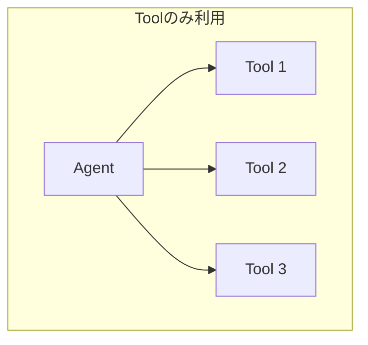
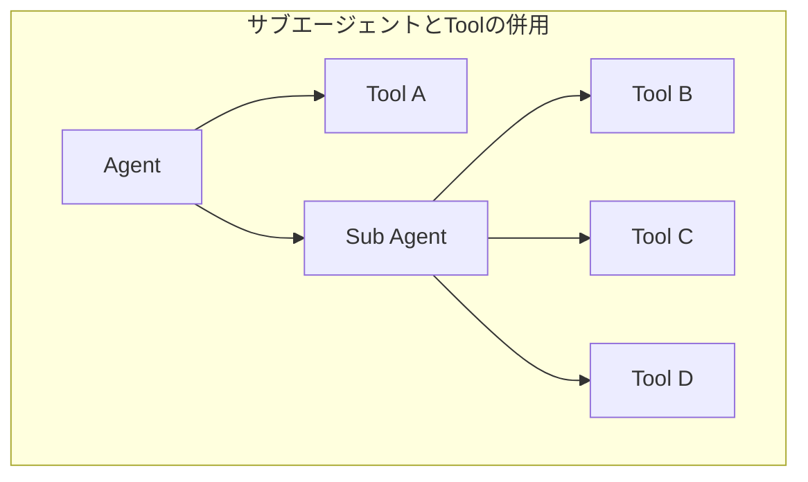

この記事はアドベントカレンダー「Goで作るセキュリティ分析生成AIエージェント」の14日目です。本日はメインの生成AIエージェントが複数のサブエージェントを利用する、サブエージェントアーキテクチャについて解説します。

今回のコードは https://github.com/m-mizutani/leveret の [day13-context-compression](https://github.com/m-mizutani/leveret/tree/day13-context-compression) ブランチに格納されていますので適宜参照してください。


# サブエージェントの概念と必要性

- サブエージェントはメインで動くエージェントがさらに異なるエージェントを呼び出す、という発想
- 基本は呼び出す先のエージェントもツールを使うので本質的にやることは大きくは違わない
- しかしサブエージェントに問題領域をうまく引き継がせることでモジュール化・カプセル化的な利点を生むことができ、設計上のアドバンテージになる「場合がある」
- 一方で構成は複雑化する。ゆえに何でもかんでもAgent化すればいいってもんでもない
- イメージとしては以下の図のような感じ
  - 基本はツールと並行してエージェントが存在する考えで良い
  - エージェントの先にエージェントがいる場合もあるが、今回は階層が一段階のみのものとする





# サブエージェントの利点と欠点

- サブエージェント

## 利点

- コンテキスト消費の抑制
  - まずこれがかなり大きい
  - 例えば「ログデータを調査する」というタスクを投げるとき、最終的に見つかったデータだけ得られれば良い
  - しかし実際は様々な試行錯誤が発生する
  - この試行錯誤をできることが生成AIエージェントの強みである一方、コンテキストとしては無駄である
  - エージェント化すると結果を得たあとはこの過程を不要なものとしてシュッと捨てることができる
  - これによってコンテキスト増加を抑制することができるようになる
- モデル切り替えが容易
  - 処理の途中でモデルを差し替えるというのが非常に簡単にできるようになる
  - 例えばモデルAはロジックに強いがコストが高い、モデルBは大量データの読込に強いかツール呼び出しが下手くそ、みたいないろいろ特徴がある
  - もちろん力技で差し替えることはできるがコンパチを考える必要がある
    - 同じプロバイダのモデルでも起こり得る（例えば上限の問題や、このモデルではこの機能が使える使えないみたいな問題）
    - さらにこれが別プロバイダをまたがるとなるともう大変
      - 履歴をコンパチに運用するの本当にむずい
  - エージェントで分離していると、このタスクをするエージェントはこのモデルみたいな割当が非常に容易にできる
- 並列化が可能
  - タスクに依存関係がない・相互干渉がない場合、複数エージェントに一度に投げて応答時間を短縮するということができる
  - ただしこれはスケジューリングの概念が必要になる
    - 複数タスクに対しての依存関係を明確に推定したうえで実行する必要がある
    - これはエージェントの実行計画問題になる。詳しくは後日
  - また応答時間の圧縮にはなるが、AIエージェントのpainの本質はあまり応答時間でないことが多いので効果は限定的
- 問題領域の限定化
  - 問題領域を絞れるので対応も特化できる
  - たとえばシステムプロンプトにいろいろ書き込むことができる
    - 以前解説したように、生成AIは「知らないものは探さない」のでツールなどについても適切に情報を与えて上げる必要がある
    - しかしツールが多くなってくると情報がごちゃついてしまい適切に処理されなくなる
    - あとは文脈が限定されるので「こういう場合はやり直せ」とか「こういう状況ではコレを疑え」みたいなこまい指示を色々いれやすくなる
  - また一度に呼ばれるツール郡も限定されるのでデバッグしたり制御したりというのっがやりやすくなる
  - これは一般的なプログラミングのモジュール化と同じ発想である

## 欠点

- コンテキストの欠落
  - 当然ながらサブエージェントに渡されるコンテキストは命令元のメインエージェントに比べると欠落する
  - インターフェースの設計にもよるが、例えば自然っ言語で渡すみたいな場合だとめちゃくちゃ削れる
  - なので「これまでの情報をもとに〜する」みたいな全てのコンテキストを必要とする処理は圧倒的にむかない
  - あくまで仕事としてうまく切り出して、短い命令で期待する結果を得られるような、そんな移譲可能タスクのみがエージェントとして活用できると考えたほうがよい
- 設計がかなり難しい
  - コンテキストの欠落とかなり関連する
  - とりあえずAPIプロキシをポン起きすればいいシンプルなFunction Calling（ないしMCP）とは全然ちがう
  - このユースケースなら、どの程度のコンテキストを受け取ってタスク移譲すればワークするか？というのを常に考える必要がある
  - どういうインターフェースにすればいいかなどもセンスが問われる
- コントロールが難しい
  - ただでさえ１つのエージェントでも結構扱いが難しい
  - サブエージェントにタスクを移譲するだけでも一気に複雑化する
  - さらに複数エージェントを協調とかさせようとするとアタマが狂う
  - 筆者視点だとまだまだこの分野は成熟していない

## 考慮点

- 権限の移譲
  - プロセスを分離する（リモートからアクセスできるエージェント含む）場合、1つのエージェントに権限を集中させなくて良いという利点は生まれる、とされている
  - しかし一方でそのエージェントはどのような認可を持つべきか？ という問題が生じる
  - いろいろなところから多様な用途でアクセスされるエージェントだとすると非常に強力な権限を保つ必要がある
    - そのためそのエージェントが危殆化すると結局影響範囲は大きい
  - 一方で利用者の権限を伝搬させる方式（例えばOAuth2, OIDC トークンの伝搬）のような仕組みをもたせるならAgent分けようがわけなかろうがあんまり変わらなくなる
  - そのため認可・権限まわりについてはアーキテクチャを含めてよく検討する必要がある
  - 今回はプロセス統合型なので権限の話はしない
- サブエージェントの制御
  - ここでいうワークフロー
  - サブエージェントに重厚なタスクをやらせるとなかなか返ってこなくなる
  - 深追いさせたいタスクならいいが、ただでさえメインエージェントで時間がかかっていると応答時間が

# エージェントの設計と通信パターン

- サブエージェントも基本的にはツール呼び出しと本質的には変わらない
- MCP（Model Context Protocol）よりさらに外部プロセスのエージェント呼び出しに特化したA2A（Google考案のAgent2Agentプロトコル）も存在する
  - しかしこの文章を執筆している2025年現在だとあまり活用事例は多く聞かない
  - 複数エージェントを協調的に使うというユースケースがおそらくまだあまりない
    - そもそも1つのエージェントを制御するだけで手一杯
- 今回はTool呼び出し、Function callingの延長としてサブエージェントの呼び出しを実装する
  - 実装が統合されていたほうがデバッグなどもしやすい
  - 今回のユースケースだとリモート化する意味もない
    - とはいえ分離してMCP・A2Aで実装することもできなくはない

# サブエージェントの実装例

- 今回はBigQueryの検索タスクをエージェント化する
- 基本的に、以前実装したBigQueryのツール類一式をもつエージェントを作成し、これを呼びだす構成にする
- `pkg/tool/bigquery` を捨てて [pkg/agent/bigquery](https://github.com/m-mizutani/leveret/tree/day14-sub-agent/pkg/agent/bigquery) にツールごと引っ越しをする
- 先述した通り、インターフェースは `Tool` と同じにするので、他のツールと同じように並べて登録だけしちゃえば良い

```go:pkg/cli/chat.go
	// Create tool registry early to get flags
	registry := tool.New(
		alert.NewSearchAlerts(),
		otx.New(),
		bigquery.New(),
	)
```

- その代わりToolとしてのインターフェースは `bigquery_run` という非常にシンプルな Function Declaration に統一
  - 説明に自然言語で指示しろっていうのを書いておく
  - さらに

```go:pkg/agent/bigquery/tool.ggo
// Spec returns the tool specification for Gemini function calling
func (t *Tool) Spec() *genai.Tool {
	return &genai.Tool{
		FunctionDeclarations: []*genai.FunctionDeclaration{
			{
				Name:        "bigquery_run",
				Description: "Execute BigQuery analysis using natural language. This tool translates your request into SQL queries, executes them, and returns analysis results. Use this for log analysis, security investigation, and data exploration.",
				Parameters: &genai.Schema{
					Type: genai.TypeObject,
					Properties: map[string]*genai.Schema{
						"query": {
							Type:        genai.TypeString,
							Description: "Natural language description of what you want to analyze or query from BigQuery",
						},
					},
					Required: []string{"query"},
				},
			},
		},
	}
}
```

- またあわせてどういうテーブルがあるかはメインエージェント側に伝える
  - ただしこれはあまり詳細を返してもしょうがない可能性もある
  - 場合によっては生成AIで要約した内容を付与するみたいな方法もありえる
  - これについては調整の余地があり、ユースケースやあつかうテーブルの数などに合わせてほしい

```go:pkg/agent/bigquery/tool.ggo
// Prompt returns additional information to be added to the system prompt
func (t *Tool) Prompt(ctx context.Context) string {
	if !t.enabled || t.agent == nil {
		return ""
	}

	// Only expose table list to main agent (not runbooks)
	if len(t.agent.tables) == 0 {
		return ""
	}

	var sb strings.Builder
	sb.WriteString("### BigQuery Tables\n\n")
	for _, table := range t.agent.tables {
		sb.WriteString(fmt.Sprintf("- **%s**", table.FullName()))
		if table.Description != "" {
			sb.WriteString(fmt.Sprintf(": %s", table.Description))
		}
		sb.WriteString("\n")
	}

	return sb.String()
}
```

- Executionされる実態はこちら
- メインエージェントのように繰り返し処理をする
  - iteration内で毎回GenerateContentする
  - Function callが返ってきたらそれにしたがってToolを実行
    - Toolは基本、先日実装したbigqueryのツールと同じ
  - ここでもちゃんとmaxIterationを指定して無限ループ防止をする
    - イテレーション制限は難しいところで、どのくらい複雑なタスクをエージェントにやらせるか次第で調整っが必要
  - ここには書いてないが、処理の途中結果をなるべく表示してあげると使っている側も処理が進行しているのを見れて安心
    - あとあらぬ方向に進んでいるときに中断できるようになる
- function callがなかったら結論とみなしてメインエージェントに結果と処理フローを戻す

```go:pkg/agent/bigquery/agent.go
// Execute processes a natural language query and returns the result
func (a *Agent) Execute(ctx context.Context, query string) (string, error) {
	// Build system prompt with context
	systemPrompt := a.buildSystemPrompt()

	// Create initial user message
	contents := []*genai.Content{
		genai.NewContentFromText(query, genai.RoleUser),
	}

	// Build config with tools
	config := &genai.GenerateContentConfig{
		SystemInstruction: genai.NewContentFromText(systemPrompt, ""),
		Tools:             []*genai.Tool{a.internalToolSpec()},
	}

	// Tool Call loop
	const maxIterations = 16
	var finalResponse string

	for i := 0; i < maxIterations; i++ {
		resp, err := a.gemini.GenerateContent(ctx, contents, config)
		if err != nil {
			return "", goerr.Wrap(err, "failed to generate content")
		}

		if len(resp.Candidates) == 0 || resp.Candidates[0].Content == nil {
			return "", goerr.New("empty response from Gemini")
		}

		candidate := resp.Candidates[0]
		contents = append(contents, candidate.Content)

		// Check for function calls
		hasFuncCall := false
		for _, part := range candidate.Content.Parts {
			if part.FunctionCall != nil {
				hasFuncCall = true
				// Execute the internal tool
				funcResp := a.executeInternalTool(ctx, *part.FunctionCall)

				// Add function response to contents
				funcRespContent := &genai.Content{
					Role:  genai.RoleUser,
					Parts: []*genai.Part{{FunctionResponse: funcResp}},
				}
				contents = append(contents, funcRespContent)
			}
		}

		// If no function call, extract final text response
		if !hasFuncCall {
			var textParts []string
			for _, part := range candidate.Content.Parts {
				if part.Text != "" {
					textParts = append(textParts, part.Text)
				}
			}
			finalResponse = strings.Join(textParts, "\n")
			break
		}
	}

	return finalResponse, nil
}
```

- またシステムプロンプトも個別に設定する
- 全文は [こちら](https://github.com/m-mizutani/leveret/blob/day14-sub-agent/pkg/agent/bigquery/prompt/system.md) をみてもらうとして、個別に解説するところだけ抜粋

```md
## Workflow

1. Understand the user's analysis request
2. If a suitable runbook exists, use `bigquery_runbook` to get the pre-defined query
3. Get table schema using `bigquery_schema` if needed to understand the data structure
4. Execute SQL queries using `bigquery_query`
5. Retrieve and analyze results using `bigquery_get_result`
6. Provide insights based on the query results
```

- ワークフローとして基本的な手順を記述しておく
  - これによって例えば初手いきなり推測でクエリを書こうとするのを防ぐ
  - こういう指示も全部一緒くたのツールが横並びになっていると説明がごちゃまぜになってしまうが、問題領域が別れていることで記述しやすい

```md
## Important Guidelines

- Always validate table existence before querying
- Use LIMIT clauses to avoid excessive data scans
- Consider time ranges to narrow down results
- When query results are large, use pagination with offset
- Explain your findings in the context of security analysis
- If the scan limit is exceeded, modify the query to reduce data scanned
```

- ツールを使ううえでの注意もかける
  - たとえばLIMITちゃんと使いなさいとか（これは課金問題防止というより、クソデカデータを返さないようにする予防措置）

```md
## Unexpected Result Recovery

**CRITICAL**: When query results are unexpected (0 rows, missing expected data, strange values), DO NOT immediately trust the result. Instead:

1. **Question the search criteria** - The field values may not match your expectations
   - Field format might be different (e.g., IP as string vs integer, timestamps in different formats)
   - Field names might be different from what you assumed
   - Values might use different conventions (e.g., "ERROR" vs "error" vs "ERR")
   - Data might be in nested or repeated fields

2. **Verify field values** - Issue a separate query to check what values actually exist:
   -- Check distinct values in a field
   SELECT DISTINCT field_name FROM table LIMIT 100

   -- Check value patterns
   SELECT field_name, COUNT(*) as cnt
   FROM table
   GROUP BY field_name
   ORDER BY cnt DESC
   LIMIT 20
```

- あとは実行結果に対する方針も記述しておきやすい
- この例だと結果が見つからなかったらフォーマットなどを疑ったり、こうやって確認しろみたいなことが書いてある
- これは実際人間がやったときも同じような確認作業をするんだが、生成AIはこのあたりをちゃんと指示しておかないと勝手に推測してクエリ作ってだめでした、になる
- そのため「こういう状況ではこうしろ」みたいなプラクティスをちゃんと渡す必要がある
- これももちろん、ツールでも同じように記述できなくはないが、エージェントとして分割したことによって文脈が限定され説明がしやすくなっているというのがポイント

:::details 実際の実行結果 ( examples/alert/scc.json のデータを投入したAlertに対する問い合わせ)

```bash
$ go run . chat -i 81aa9921-3dea-4365-ac18-5967596933ac
Enabled tools: [search_alerts query_otx bigquery_run]

Chat session started. Type 'exit' to quit.

> このアラートに関連するインスタンスが直近で変更された形跡があるかを調査し、結果を報告せよ

⠸ thinking...
💭 インスタンス「web-server-prod-01」の最近の変更履歴を調査します。アラートのイベント時刻（2025-11-08T05:23:47.891Z）の24時間前までのCloud Audit Logsを確認し、関連するアクティビティを探します。

🔧 Calling tool: bigquery_run
   Args:
{
     "query": "Compute Engineインスタンス 'web-server-prod-01' (プロジェクト 'production-project-12345') のCloud Audit Logsを、2025-11-07T05:23:47.891Zから2025-11-08T05:23:47.891Zまでの期間で表示してください。タイムスタンプ、メソッド名、プリンシパルメール、発信元IPアドレスを含めてください。"
   }
⠙ thinking...  📊 BigQuery: 0 rows, 0 MB scanned
  Query: SELECT
  timestamp,
  protopayload_auditlog.methodName,
  protopayload_auditlog.authenticationInfo.principalEmail,
  protopayload_auditlog.requestMetadata.callerIp
FROM
  `mztn-audit.google_cloud_audit.cloudaudit_googleapis_com_activity`
WHERE
  resource.type = 'gce_instance'
  AND resource.labels.project_id = 'production-project-12345'
  AND protopayload_auditlog.resourceName LIKE '%web-server-prod-01%'
  AND timestamp BETWEEN '2025-11-07 05:23:47.891Z' AND '2025-11-08 05:23:47.891Z'
LIMIT 100
⠴ thinking...  📊 BigQuery: 13 rows, 2 MB scanned
  Query: SELECT DISTINCT resource.type FROM `mztn-audit.google_cloud_audit.cloudaudit_googleapis_com_activity` LIMIT 100
⠸ thinking...  📊 BigQuery: 20 rows, 42 MB scanned
  Query: SELECT DISTINCT resource.type FROM `mztn-audit.google_cloud_audit.cloudaudit_googleapis_com_data_access` LIMIT 100
⠴ thinking...  📊 BigQuery: 5 rows, 0 MB scanned
  Query: SELECT DISTINCT resource.type FROM `mztn-audit.google_cloud_audit.cloudaudit_googleapis_com_system_event` LIMIT 100
⠼ thinking...  📊 BigQuery: 5 rows, 0 MB scanned
  Query: SELECT DISTINCT resource.type FROM `mztn-audit.google_cloud_audit.cloudaudit_googleapis_com_system_event` LIMIT 100
⠙ thinking...  📊 BigQuery: 0 rows, 0 MB scanned
  Query: SELECT
  timestamp,
  protopayload_auditlog.methodName,
  protopayload_auditlog.authenticationInfo.principalEmail,
  protopayload_auditlog.requestMetadata.callerIp
FROM
  `mztn-audit.google_cloud_audit.cloudaudit_googleapis_com_activity`
WHERE
  protopayload_auditlog.serviceName = 'compute.googleapis.com'
  AND resource.labels.project_id = 'production-project-12345'
  AND protopayload_auditlog.resourceName LIKE '%web-server-prod-01%'
  AND timestamp BETWEEN '2025-11-07 05:23:47.891Z' AND '2025-11-08 05:23:47.891Z'
LIMIT 100
⠼ thinking...  📊 BigQuery: 0 rows, 0 MB scanned
  Query: SELECT DISTINCT protopayload_auditlog.resourceName FROM `mztn-audit.google_cloud_audit.cloudaudit_googleapis_com_activity` WHERE protopayload_auditlog.serviceName = 'compute.googleapis.com' AND resource.labels.project_id = 'production-project-12345' AND timestamp BETWEEN '2025-11-07 05:23:47.891Z' AND '2025-11-08 05:23:47.891Z' LIMIT 100
⠙ thinking...  📊 BigQuery: 0 rows, 13 MB scanned
  Query: SELECT DISTINCT protopayload_auditlog.resourceName
FROM
  `mztn-audit.google_cloud_audit.cloudaudit_googleapis_com_activity`
WHERE
  protopayload_auditlog.serviceName = 'compute.googleapis.com'
  AND resource.labels.project_id = 'production-project-12345'
LIMIT 100
⠦ thinking...  📊 BigQuery: 0 rows, 0 MB scanned
  Query: SELECT
  timestamp,
  protopayload_auditlog.methodName,
  protopayload_auditlog.authenticationInfo.principalEmail,
  protopayload_auditlog.requestMetadata.callerIp
FROM
  `mztn-audit.google_cloud_audit.cloudaudit_googleapis_com_system_event`
WHERE
  protopayload_auditlog.serviceName = 'compute.googleapis.com'
  AND resource.labels.project_id = 'production-project-12345'
  AND protopayload_auditlog.resourceName LIKE '%web-server-prod-01%'
  AND timestamp BETWEEN '2025-11-07 05:23:47.891Z' AND '2025-11-08 05:23:47.891Z'
LIMIT 100
✅ Tool result:


このインスタンス「web-server-prod-01」に関連する最近の変更履歴について、BigQueryで監査ログを検索しましたが、結果は返されませんでした。これは、指定された期間内にBigQueryがこのインスタンスに対する明示的な変更ログを見つけられなかったことを意味しま
す。

### 所見
*   BigQueryでインスタンス「web-server-prod-01」（プロジェクト「production-project-12345」）のCloud Audit Logsを、アラートのイベント時刻（2025-11-08T05:23:47.891Z）の24時間前からその時刻までの期間で検索しましたが、検索結果は空でした。

### 評価
*   検索結果が空であることから、このインスタンスに対して指定された期間内で、監査ログに記録されるような明示的な変更操作や管理操作は確認できませんでした。
*   ただし、これは、特定のログエントリが存在しないことのみを示しており、他の種類のログ（例えば、OSレベルのシステムログやアプリケーションログ）には活動があった可能性は排除できません。
*   また、アラートの`access.methodName`に`v1.compute.instances.start`とあり、`principalEmail`が`attacker@external-domain.com`となっていることから、外部からの不正なインスタンス起動、または設定変更が行われた可能性が示唆されています。BigQueryの検索でこれらがヒットしなかったのは、検索条件が完全ではなかったか、またはこれらのイベントが異なるログソースに記録されている可能性が考えられます。

### 知識のギャップ
*   `bigquery_run`の結果が空であったため、明示的な変更履歴は確認できませんでした。
*   インスタンス起動に関するログがCloud Audit Logsに含まれていないか、検索条件がより詳細である必要がある可能性があります。
*   インスタンスのOS内部での変更（ファイルのダウンロード、実行など）は、Cloud Audit Logsには直接記録されません。

### 推奨されるアクション
1.  **より広範な期間でCloud Audit Logsを再調査する**: 不正アクセスやインスタンス起動のイベントが、指定した24時間よりも前に発生した可能性を考慮し、調査期間をさらに広げてみてください。
2.  **`access.methodName`を具体的に指定してCloud Audit Logsを検索する**: `v1.compute.instances.start`などの具体的なAPI呼び出し名を指定して、関連するログエントリを直接検索してみてください。
3.  **VMインスタンス内部のログを確認する**: `web-server-prod-01`のシステムログ（例: `auth.log`, `syslog`, `bash history`など）を取得し、不正なコマンド実行やファイル変更の痕跡がないか調査してください。
4.  **Cloud Loggingで他のログタイプを調査する**: Cloud Audit Logsだけでなく、VPC Flow Logsやその他のCompute Engine関連ログなど、他の利用可能なログタイプも確認してください。

### 結論
インスタンス「web-server-prod-01」について、アラートイベント時刻の24時間前までのCloud Audit Logsを調査しましたが、明示的な変更履歴は確認できませんでした。この結果は、より詳細なログ検索や、インスタンス内部のログ、および他のログソースの調査が必要であることを示唆しています。特に、アラートが示す不正なインスタンス起動や設定変更に関する詳細を把握するためには、さらなる調査が必要です。
```
:::

- これらの実装をもとに実行したのが上記実行結果
- ちゃんと自然言語でうけた指示を解釈しSQLを発行している
- またログが見つからなかった場合にリカバリをしている
  - この例ではクエリが間違っていることを疑ってどのような値がフィールドに入っていたかなどを調査している
  - この調査の過程のコンテキストはサブエージェントのタスク完了後に削除されるため無駄なコンテキスト消費にもならない

# まとめ

サブエージェントアーキテクチャは、単にエージェントを階層化するだけでなく、**問題領域をモジュール化する設計パターン**です。本質は「どのタスクを切り出せば、短い命令で期待する結果を得られるか」という見極めにあります。

重要なのは、サブエージェントが銀の弾丸ではない、という点です。コンテキストの欠落は避けられず、設計の複雑化も伴います。しかし、BigQueryの調査のような**試行錯誤が必要だが最終結果だけが重要なタスク**には非常に効果的です。中間過程を捨てられることでコンテキスト消費を抑制し、問題領域が限定されることで詳細なガイドライン（リカバリ戦略やベストプラクティス）を埋め込みやすくなります。

サブエージェントの導入では、まず「このタスクは移譲可能か？」をよく検討するべきです。全てのコンテキストを必要とする処理や、メインエージェントとの密な連携が必要なタスクには向きません。一方で、独立した調査や変換処理のように、入力と出力が明確に定義できるタスクは良い候補です。

実装面では、Tool呼び出しと同じインターフェースを保つことで既存システムへの統合が容易になります。また、サブエージェント専用のシステムプロンプトを設けることで、そのタスクに特化した指示や注意事項を詳細に記述できるようになります。これは一般的なプログラミングにおけるモジュール化と同じ発想であり、適切な粒度で責務を分離することがシステム全体の品質向上につながります。
