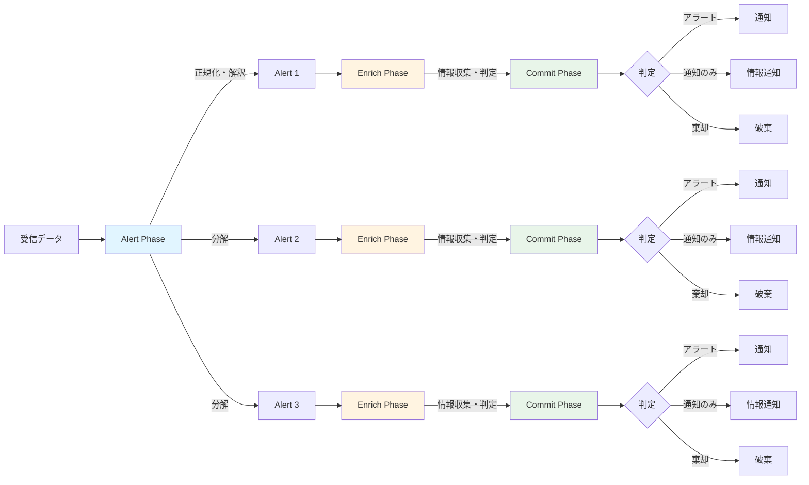

この記事はアドベントカレンダー「Goで作るセキュリティ分析生成AIエージェント」の16日目です。

# AIワークフローとは

- ここでは、一般的なワークフローエンジン・管理ツールに生成AI機能を足したものと定義する
  - ワークフローエンジンとは処理、入出力、条件分岐などの処理を接続して一連の手続き・業務を表現・実行するもの
  - 処理や入出力には外部サービスとの連携も含まれる、というかそっちが本題
  - AIが組み込まれたものの他の呼び名としては、AIアプリケーションビルダー / LLMオーケストレーション / AIエージェントフロー、みたいな呼び方をされている
  - OSSだとn8n、Difyなどが挙げられる
  - 直接コードを書くより簡単に表現できるというのがポイント
    - DSLで記述したり、GUI上で設定するなどがある
    - コーディングができない・したくない人に有用
- AIを利用する役割は大きく分けると3つ
  - データの加工
    - 雑多な自然言語を構造化データに直したり、特定のキーワードを抽出したり、なんらかの法則でデータを変換するなど
    - 既存のワークフローでの処理はだいたいがルール記述によって決定性のある処理をできる
    - ただしfuzzyなデータを扱う場合だとルール書くのがメチャクチャ大変
    - 自然言語とかどうにもならん
    - これを生成AIだとかなりいい感じに構造データに変換したりしてくれる
    - 自然言語 → 自然言語ももちろんある
      - 通知文面作成みたいな
  - 条件分岐判定
    - やっていることはデータ加工と本質的には同じだが、目的がちょっと違う
    - これもいままでは個別にルールをかかないといけなかったが、fuzzyな判定に使うことができる
      - もちろんクリティカルな業務に使うことはできないが
  - エージェント処理
    - 他システムにアクセスする系
    - 調査する：データ収集、収集対象を自分で判断したりする
    - 作成・変更する：ドキュメント作成、チケット作成、スケジュール作成などなど

# セキュリティ分析で利用するワークフロー

- これはようするにSOARです
  - ただしSOARは死んだ。SOAR is dead
    - SOAR is deadの話は以前に解説した通り
  - そこでSOAR＋AIにするといろいろ軽減される
- ただしSOAR＋AIで全て解決するわけではない
  - やはりルールを書くのが大変
  - そもそもルール書かなくてもエージェントに命令するだけでだいたいよしなにやってくれる
  - エージェントは伴走する存在。SOARはそういうのじゃない
- それでもワークフローはほしい理由
  - 決定性のある処理は決定性をもってやったほうがよい
    - 例えば生成AIで特定条件を無視させる、みたいなのも概ねうまくいくが一抹の不安がある
    - 確実性をもって処理するための仕組みは欲しい
      - なんならルールを生成AIに書かせて人間がレビューすればよい。それで基本の動作は保証できる
  - セキュリティ分析だと特にアラートの事前処理をしたい
    - 初期トリアージ

# ワークフローを独立して実装する必要があるのか？

- わざわざワークフロー機能とか言ってないで、普通にコードで表現すればいいんでは？
  - それはそう
  - だいたいのユースケースや要件はそれで充足する
  - しかしワークフローとして分離しておいたほうが良いケースも有る
- ワークフローを別の系で実装したほうがよい理由
  - ロジックを（やや）平易に表現できる
  - ランタイムとロジックを分離できる
    - 実装分離が明確化されているとコード上の整理としては良い。リファクタなどがしやすくなる
    - ランタイム実装者とロジック実装者を切り分けられる。より運用寄りの人がロジックをいじりやすくなる
- 実際にはソースコード上ので実装で十分な場合もあるが、今回はあえてワークフローを別で実装してみる

# セキュリティアラートに対応するワークフローの設計のための整理

- まじめにワークフローエンジンを作ろうとすると超大変
- 自由度を高めるために大量の機能を作る必要がある
- しかし今回はユースケースがはっきりしているので、それに応じたワークフローを作る

## ユースケースの整理

- このワークフローは外部システムからアラートを受け取るたびに実行されるものとする
  - 今回はあくまで学習のため実装しやすさを優先してCLIチャットとして実装しているが、本来はアラートが発生したらそれを受信 → 処理するためのサービスとして実装するのがよい
  - そのためアラートが発生するたびに、自動的に何かしらの処理を実行したいというのがユースケース
- 逆にワークフローが実行されるのはアラート到着時だけでよい
  - SOARだと例えば人間が任意のタイミングでトリガするようなユースケースも組むことができる
  - しかし人間が指示するならAIエージェントで十分説がある
    - やるとしてもあらかじめ用意しておいたプロンプトを実行するようなもの、AIコーディングエージェントで用意されているカスタムコマンドに近い概念で十分ではと考える
    - これについては今回のアドベントカレンダーでは実装しないが実装する価値があることだけは言及しとく
  - もちろん定型業務がバチッと決まっているような場合は実装する価値はある
    - ただその場合はセキュリティ分析エージェント内に実装するのではなく、フローを外部に要して叩く方法も検討しうる
    - なぜならそういうタイプのワークフローはだいたい外部干渉系のワークフローである
      - 例えばFWのルールを変える、インスタンスを停止する、EDRの機能で端末に干渉する、などなど
      - そういうワークフローは強い権限を持つのでセキュリティ分析エージェントとは切り離し、実行アカウントの権限を分離しておいたほうがよい
        - これは単純に最小権限化というのもあるが、セキュリティ分析エージェントはいろんなツールを使う際に誤って強い権限が発動されると怖いので、エージェントの実行アカウントは読込系を中心にしておいたほうがいいよ
      - そういう機能の発火トリガ機能は作ってもいいかもだが、むしろ一発指令を飛ばすだけにするみたいな設計のほうがいいかもしれない
      - あとそういう破壊的変更を伴うワークフローに生成AI機能を織り交ぜるのは普通に怖いと思う
      - いずれにせよ今回はそういうタイプはここでは扱わない

## 具体的なワークフローに必要な機能

- セキュリティ分析において、アラート受信時にするタスクの機能は主に3つ考えられる
- 実装をきれいに分離できるわけではないが、まずは機能としての整理

### (1) アラートの解釈

- 取得したアラートの内容を解釈する
  - 分析云々ではなくアラート本文データ内にある項目を変換したり、共通の項目へ置き換える正規化など
  - アラートの要約を作成させたりするのもこれにあたる
    - タイトルや要約作成は以前にやったね
- 受信したものをアラートとして扱うかどうか（無視してもいいか）という判断も含まれる
  - これはアラートを送信する側で抑制すべきという考え方と、受信した側で制御するべきという考え方がある
  - 個人的にはなるべく送信する側で制御したいが、現実問題としてそもそも制御できないような検知機構も多い
  - またルールを統合的に管理できるという意味では、受信側で管理したほうがよいという観点もある
- このあたりの、分析まで行かずともアラートの理解をする整理をするというフェーズがまず必要である

### (2) 関連情報の収集

- SOARなどでユースケースが多いやつの一つ。enrichと呼ばれることが多い
- 各所からそのアラートに関連しそうな情報を収集して、そのアラートに付与する
  - 検索する内容については「セキュリティ分析のためのツール・サブエージェント」の回を参照のこと
- ここまでで解説したものはエージェントに依頼して情報を集めるというのを主眼においていた
- もちろんそれでもいいのだが、「この種類のアラートなら必ずこの調査をする」というのが決まっているなら、人間が介入する前に先手を打って調査したほうがよい
- これは従来型の決定性ルールのSOARのフローでもやりうるが、生成AIベースだと次のような強い利点がある
  - (1) IoC調査などに使うデータの取り出しに関するルールを明確に記述しなくてもよい
    - SOARでやる場合、どの種類のアラートのどのパスのどのフィールドにどういう値が入っているか、というのを明確に定義する必要がある
      - これはアラートの種類が増えると本当に辛い
      - しかもたまに急にアラートのスキーマが変わってキレそうになる
    - しかし生成AIの場合、（値の抽出のパートでもやったとおり）ある程度はよしなに関連しそうな値を抽出してくれる
    - 真に大事なIndicatorが入っているフィールドはちゃんとルールで指定すれば良い一方、関連情報としてはいってくるようなものについては雑に抽出し、それについて調べよ、というようなことを指示すればよい
  - (2) 手順を厳格に指示しなくてもある程度エージェント的に処理してくれる
    - SOARの場合、ワークフローに関して「こうだったらこうしろ」みたいなのを大量に分岐を書く必要がある
      - 例えば脅威DB(a)で情報が見つかったら脅威DB(b)で深堀りしろ、みたいな指示
      - しかしそれもアラートの種類やスキーマが増えるとルールが爆発的に増える
    - 生成AIエージェントの指示は自然言語でできるので融通がきくため、大量のルールを管理する必要がない
      - もちろんクリティカルならルールで決定的な処理をしよう
      - しかしちょっとした例外にも強くなるというのは非常に助かる
- というようなことから、生成AIを使った関連情報の収集は（もちろん生成AIエージェントに直接問い合わせてもいいが）ワークフローとして事前にやっておくなどの場合でも、非常に有用である

### (3) 初動処理

- 最終的にそのアラートを初動でどう扱うかを決める
  - severityを決めてそれに応じて通知とかをやる
  - 場合によっては通知しない、通知だけはするが対応不要としておく、あるいはアラートとして棄却するというのもありえる
  - あと通知先決めるとか、誰が担当するかみたいなのもある
- SOARでは決定性のあるルールでやる
  - 再三言っているが、アラートの数が増えてくると非常にしんどくなる
  - 最終的にだいたい全部同じseverityになる
    - せいぜい棄却 or escalationの2択
- これも生成AIベースでseverity判定などをして、それに基づいて初頭処理を変更することができる
  - ただし生成AIにいきなり「severity判定して」と投げかけても難しい
  - そこでenrichで取得した情報を利用したり、コンテキストをちゃんと与える
    - enrich情報はそのまま必要な情報として使える
    - コンテキストとは自組織の独自の情報。これをいかにうまく与えるかで判定の精度は大きく異なる
      - 例えば使っているインフラ、サービス、ソフトウェアの情報
      - 開発スタイル、ソフトウェアの開発、管理スタイル
      - インフラ変更に関する手順やどういう方針で変更しているか
      - その他、独自に決めているルールなど
      - あとはセキュリティポリシーや体制の情報も役立つ
      - また具体的にこういうアラートをこう処理する、という事例をfew-shot prompting的に与えておくのも良い
    - コンテキストが足りないと適当なことしか言わないが、逆にこれが足りているとある程度論理的な回答をする
      - ただし当然ハルシネーションなどは一定起こりうるので、防御的な判断にしつつ人間のレビューを入れる（例えばseverityが低いと判断されたものも1日1度目だけ通すようにする、など）が現段階では適切と考えられる

# ワークフローのアーキテクチャ設計

- 今回はあくまで「定常的にセキュリティアラートを受け付けるサービスの初動対応ワークフローの一例」という観点でみてほしい
- 他のやり方もあるが設計、実装のポイントなどをみていく

## 基本方針

- 自由な状態遷移をするワークフローは不要とする
  - A → B → C… と処理と分岐と遷移のフローチャートをかけるやつ
  - なぜならやることがある程度限られているので自由度をもたせる必要がない
- 各タスクの表現には[OPA](https://github.com/open-policy-agent/opa) (Open Policy Agent) ＋ [Rego](https://www.openpolicyagent.org/docs/policy-language)を使います
  - コードから分離された判定のロジックを記述するのに便利
  - とくにOPA/Regoに拘る理由はなく、他の処理系などでももちろんOK
  - ただ独自にjsonやyamlでワークフロー機能を作ろうとするのはあんまりおすすめしない
    - なぜなら判定のロジックでちょっと複雑なことをしようとすると途端にソースコード側の実装がややこしくなるから
    - それなら既存の何かを使うのを勧める

## 全体構成

- `alert`, `enrich`, `commit` という3つのフェーズをもつワークフローにする
- `alert`
  - 受信したアラートを解釈・正規化する
  - 例えばタイトルや要約、抽出する属性値などを決める
  - また一度の受信に複数アラートが含まれる場合もある（例えばAWS guard dutyのfindingsとかはそういうスキーマ）ので、これを分解する
    - 分解されたらそれは別のアラートとして扱われ、以降は異なるスレッドに分岐して処理するイメージ
  - 生成AIによるタイトル、要約の生成や属性値抽出は自動でやるので明示的に記述しない
- `enrich`
  - データ取得をするところ
  - といいつつ生成AI問い合わせや生成AIエージェントを走らせるフェーズといったほうが正確かも
  - 生成AIでなんらか判定させたり、情報を収集させるエージェントを走らせたりする
    - 「情報を取得したうえで判定をだす」というようなユースケースも、エージェントにそういうプロンプトを渡せば実現できる
- `commit`
  - 最終的にどうするのか決定するフェーズ
  - 今回はとりあえずアラートとして扱う、通知だけする、棄却、の3パターンの判定だけする
  - この他にも自動アサインだったり、 `enrich` の結果から属性値をalertに追加したりみたいなこともここでやるとよい

# まとめ

セキュリティアラート分析における生成AI活用のワークフローについて、設計の観点から解説しました。従来のSOARが抱えていた「ルール管理の複雑化」という課題に対し、生成AIを組み込むことで柔軟性と実用性を両立させるアプローチを示しました。

今回提案した `alert` → `enrich` → `commit` の3フェーズ構成は、決定性が必要な処理とAIの柔軟な判断を適切に使い分けるための設計です。特に重要なのは、enrichフェーズで収集した情報とコンテキストを組み合わせてcommitフェーズの判定精度を高めるという流れです。自組織固有の情報（インフラ構成、開発スタイル、セキュリティポリシーなど）を適切に与えることで、生成AIは単なる一般論ではなく、実運用に耐える判断を下せるようになります。

ワークフローをコードから分離する意義は、ランタイムとロジックの責任分離にあります。OPA/Regoのような既存のポリシーエンジンを活用することで、運用担当者がロジックを調整しやすくなり、開発者はランタイムの改善に集中できます。

次回は、この設計に基づいた具体的な実装を見ていきます。Regoでのルール記述や、各フェーズでの生成AI活用の実例を通じて、設計を実際に動くシステムへと落とし込んでいきます。
