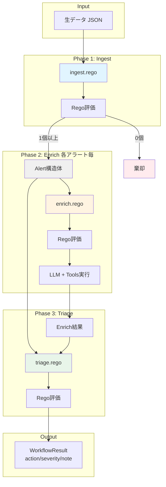
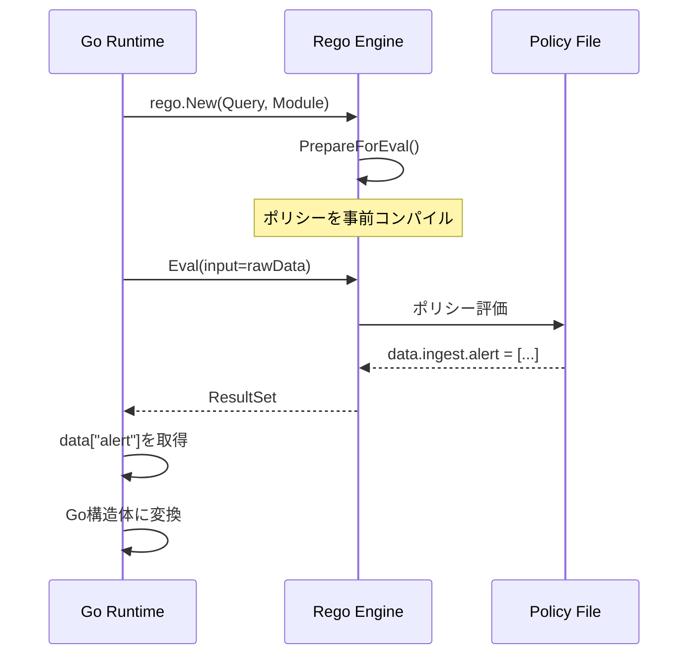
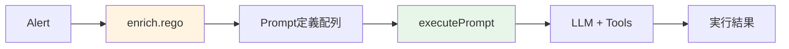

この記事はアドベントカレンダー「Goで作るセキュリティ分析生成AIエージェント」の17日目です。

今回のコードは https://github.com/m-mizutani/leveret の [day17-workflow](https://github.com/m-mizutani/leveret/tree/day17-workflow) ブランチに格納されていますので適宜参照してください。

前回（Day16）では、セキュリティアラート分析のためのAIワークフローを設計しました。`ingest` → `enrich` → `triage` という3フェーズ構成で、決定性のある処理と生成AIの柔軟な判断を組み合わせるアプローチを提案しました。

本記事では、この設計を実際のGoコードとOPA/Regoで実装していきます。OPA/Regoを選択した理由は、Day16でも述べたように、宣言的なポリシー記述によってコードとロジックを明確に分離できる点にあります。既存のツールを活用することで、独自のDSLを作るよりもメンテナンス負担を大幅に軽減できます。今回はあくまで実装例という位置づけなので、必要に応じて他のルールエンジン、あるいはワークフローエンジンを利用してください。

OPA/Regoの概念、文法などについて知りたい方は[公式ドキュメント]()意外にも、拙著[OPA/Rego入門](https://zenn.dev/mizutani/books/d2f1440cfbba94)もご参考いただければと思います。

# 全体アーキテクチャ

- ワークフロー機能は `pkg/workflow/` パッケージに実装します。
  - これはUseCaseにより密着した形で実装する手もあるが、今回はわかりやすさのために分離させた
  - 実装がそれなりに長いため、要所だけを掲載。詳しくは自分でコード見て
- ワークフロー全体のデータフローを図示します：
  - やや長いがデータと処理の流れを把握してもらえるとよい
  - 各フェーズでRegoの評価を実施し、それに応じて必要な処理や分岐を入れている
    - **Ingestフェーズ**は1回の入力から0個以上のアラートを生成
    - **EnrichとTriageフェーズ**は各アラートに対して個別に実行



# Ingestフェーズの実装

Ingestフェーズは生データを受け取り、アラートとして処理すべきものを抽出する最初のゲートです。

## 実装の設計方針

Ingestフェーズが解決する3つの課題：

1. **データ形式の正規化**：様々な形式の入力データを統一的なAlert構造体に変換
2. **複数アラートへの分解**：1つのJSONに複数の検知結果が含まれる場合の分離（例：GuardDutyのfindings配列）
3. **事前フィルタリング**：明らかに不要なアラート（開発環境のテストなど）を早期棄却

これらをRegoポリシーで宣言的に記述することで、運用中のルール調整が容易になります。

## Regoポリシーの実装パターン

Ingestフェーズのポリシーは `ingest.rego` に記述します。Regoの基本は「条件を満たすものをセットに追加する」という宣言的なスタイルです
- `package` が名前空間を指す。今回は `ingest`, `enrich`, `triage` で分けており、それらが各フェーズで評価される
- `if` 内の条件（ANDとして扱われる）が満たされると `contains` で指定された内容が `alert` （Set型）へ格納される
- `alert` には0個以上のデータを格納できる
  - ここに格納されることで次の段階（enrich）に進む

```rego
package ingest

# パターン1: 単一アラートの生成
alert contains {
    "title": input.title,
    "description": input.description,
    "attributes": [
        {"key": "severity", "value": input.severity, "type": "string"},
    ],
} if {
    # 条件を満たす場合のみアラートを生成
    input.severity == "HIGH"
}

# パターン2: 配列を複数アラートに展開
alert contains {
    "title": sprintf("Finding: %s", [finding.title]),
    "description": finding.description,
    "attributes": [
        {"key": "source_ip", "value": finding.resource.instanceDetails.networkInterfaces[0].publicIp, "type": "ipaddr"},
        {"key": "finding_id", "value": finding.id, "type": "string"},
    ],
} if {
    # findings配列の各要素を展開
    some finding in input.findings
    finding.severity >= 4  # severity 4以上のみ
    finding.resource.instanceDetails.networkInterfaces[0].publicIp != null
}

# パターン3: 棄却条件（alertセットに何も追加しない）
# 開発環境からのアラートは無視される
alert contains {
    "title": input.title,
    "description": "Test alert - will be filtered",
    "attributes": [],
} if {
    input.environment == "production"  # 本番環境のみ通す
    input.title != ""
}
```

## Goランタイムでの評価

- Regoポリシーを評価するGo実装
- 実装のポイント：
  - `PreparedEvalQuery`を使って事前コンパイル（初期化時に1回だけ）
  - 評価結果は`map[string]any`として取得し、型アサーションで変換
  - alertセットが空＝棄却を意味する（エラーではない）


```go
func (e *Engine) runIngest(ctx context.Context, rawData any) (*IngestResult, error) {
    // 1. Regoポリシーを評価（inputとしてrawDataを渡す）
    rs, err := e.ingestPolicy.Eval(ctx, rego.EvalInput(rawData))
    if err != nil {
        return nil, err
    }

    // 2. 評価結果から"alert"セットを取得
    data := rs[0].Expressions[0].Value.(map[string]any)
    alertData := data["alert"]  // Regoのalertセット
    alerts := alertData.([]any)

    // 3. Go構造体に変換
    result := &IngestResult{Alert: make([]*IngestedAlert, 0, len(alerts))}
    for _, a := range alerts {
        alertMap := a.(map[string]any)
        result.Alert = append(result.Alert, &IngestedAlert{
            Title:       alertMap["title"].(string),
            Description: alertMap["description"].(string),
            Attributes:  parseAttributes(alertMap["attributes"]),
        })
    }
    return result, nil
}
```

評価フローの流れ




# Enrichフェーズの実装

Enrichフェーズは、アラートに対する追加調査をLLMエージェントに実行させるフェーズです。

## 設計の考え方

Enrichフェーズの特徴は、**プロンプトの定義**と**プロンプトの実行**を分離している点です：



この分離により：
- **Regoポリシー**：「何を調査するか」を宣言的に記述
- **Goランタイム**：「どう実行するか」を手続き的に処理

## Regoポリシーでのプロンプト定義

`enrich.rego` では、アラートの内容に応じて実行すべきプロンプトを動的に生成します：
- `prompt` に格納されたものがタスクとなる
  - `id` はあとからどのプロンプトの結果を利用するか識別するために用意
  - `content` でどういうプロンプトを発行するか指示
  - 元アラートの情報はデフォルトで promptへ突っ込む
  - `format` を指定できるようにしてあげる。`text` or `json` で、`json` だったらunmarshalしてあげるなど
    - JSON形式を指定して構造化データを取得（後続のtriageで解析しやすくする）
    - もちろん文章がほしい（何らかのサマリや見解を作成するなど）ならtextでOK

```rego
package enrich

# パターン1: 属性値に基づく調査
prompt contains {
    "id": "check_ip_reputation",
    "content": "Check the reputation of IP addresses found in the alert using threat intelligence tools. Summarize any malicious indicators.",
    "format": "text",
} if {
    # IPアドレス属性が存在する場合のみ
    some attr in input.attributes
    attr.type == "ipaddr"
}

# パターン2: JSON形式での構造化応答
prompt contains {
    "id": "domain_analysis",
    "content": "Analyze the domain using threat intelligence. Return JSON with keys: domain, threat_score (0-10), categories (array).",
    "format": "json",
} if {
    some attr in input.attributes
    attr.type == "domain"
}

# パターン3: アラート内容に応じた調査
prompt contains {
    "id": "assess_urgency",
    "content": "Assess the urgency of this unauthorized access. Consider: 1) Time of day, 2) Affected resource, 3) Access pattern.",
    "format": "text",
} if {
    contains(input.title, "unauthorized")
    not contains(input.title, "test")  # テストアラートは除外
}
```

## プロンプトの実行

Regoで定義されたプロンプトをLLMで実行します。Function Callingの詳細は別の回で解説済みなので、ここではEnrichフェーズでの利用方法に焦点を当てます。

```go
func (e *Engine) executePrompt(ctx context.Context, prompt AgentPrompt, alert *model.Alert) (string, error) {
    // 1. プロンプトテンプレートでシステム指示を構築
    systemInstruction := buildInstructionFromTemplate(prompt, alert)

    // 2. ツール付きでLLMを設定
    config := &genai.GenerateContentConfig{
        SystemInstruction: genai.NewContentFromText(systemInstruction, ""),
        Tools:             e.registry.Specs(),
    }

    // 3. Function Callingループで調査（詳細は別回で解説済み）
    result := runFunctionCallingLoop(ctx, config)

    // 4. format="json"の場合はクリーニング
    if prompt.Format == "json" {
        result = cleanJSONResponse(result)
    }

    return result, nil
}
```

### プロンプトテンプレート（`prompt/enrich.md`）

- プロンプトは他と同じようにemebedして `text/template` で構築するとメンテナンス性が高い
- `.PromptContent`にRegoで定義したタスクを差し込む
- アラート情報を構造化して提供

```markdown
You are a security analyst assistant. Execute the following task:

{{ .PromptContent }}

## Alert Information
**Title:** {{ .Alert.Title }}
**Description:** {{ .Alert.Description }}

## Attributes
{{- range .Alert.Attributes }}
- **{{ .Key }}:** {{ .Value }} (type: {{ .Type }})
{{- end }}
```

# Triageフェーズの実装

Triageフェーズは、Enrichの結果を踏まえて最終判定を行います。

## Regoポリシーの実装

`triage.rego`では、Enrichの調査結果（`input.enrich`）を参照しながら判定できます：
- ポリシーの書き方の基本は同じだが、ここで使う `action`, `severity`, `note` はセット型ではなく文字列型
- これは原則1つしか値を書き込めない。バッティングするとErrorになるので注意
  - `default` だけ例外
  - 複数ある中から強い結果を勝たせたい、みたいな場合はセット型にしてGoのコード側で判定するみたいなのもOK
- `input.alert`: アラート自体の情報（title, description, attributes）
- `input.enrich`: Enrichフェーズの実行結果（`[]{ "id": "...", "result": "..." }`）
- Enrich結果の中身（テキストまたはJSON文字列）を`contains`や`json.unmarshal`で解析

```rego
package triage

default action = "accept"
default severity = "medium"
default note = ""

# パターン1: アラート内容による判定
action = "discard" if {
    contains(input.alert.title, "maintenance")
}

# パターン2: Enrich結果を参照した判定
severity = "critical" if {
    some result in input.enrich
    result.id == "check_ip_reputation"
    contains(result.result, "malicious")  # Enrichで"malicious"が見つかった
}

severity = "high" if {
    contains(input.alert.title, "unauthorized")
    not contains(input.alert.title, "test")
}
```


Goでの評価は、IngestやEnrichと同様に`Eval()`で評価し、結果から`action`/`severity`/`note`を取得します。

# ワークフローエンジンの統合

## ポリシーの読み込みと事前コンパイル

- ワークフローエンジンは、起動時に3つのRegoファイルを読み込んで事前コンパイルします
- regoはファイル名およびファイルパスなどに依存しないので、指定したディレクトリ以下から全regoファイルを読み込んでクエリだけ事前に振り分ける
  - `PrepareForEval()`で事前コンパイルすることで、実行時のオーバーヘッドを削減
  - ポリシーファイルが存在しない場合は`nil`を返す（エラーではない）
  - クエリは`data.<package名>`の形式（例：`data.ingest`）

```go
// loadPolicies loads all Rego files from policyDir and prepares queries for each phase
func loadPolicies(ctx context.Context, policyDir string) (ingest, enrich, triage *rego.PreparedEvalQuery, err error) {
	// Read all .rego files from the directory
	files, err := filepath.Glob(filepath.Join(policyDir, "*.rego"))
	if err != nil {
		return nil, nil, nil, goerr.Wrap(err, "failed to glob policy files")
	}

	if len(files) == 0 {
		// No policy files found, return nil for all phases
		return nil, nil, nil, nil
	}

	// Load all policy files as modules
	modules := make([]func(*rego.Rego), 0, len(files))
	for _, file := range files {
		data, err := os.ReadFile(file)
		if err != nil {
			return nil, nil, nil, goerr.Wrap(err, "failed to read policy file", goerr.Value("path", file))
		}
		modules = append(modules, rego.Module(file, string(data)))
	}

	// Prepare query for ingest phase
	ingest, err = prepareQuery(ctx, modules, "data.ingest")
	if err != nil {
		return nil, nil, nil, goerr.Wrap(err, "failed to prepare ingest query")
	}

	// Prepare query for enrich phase
	enrich, err = prepareQuery(ctx, modules, "data.enrich")
	if err != nil {
		return nil, nil, nil, goerr.Wrap(err, "failed to prepare enrich query")
	}

	// Prepare query for triage phase
	triage, err = prepareQuery(ctx, modules, "data.triage")
	if err != nil {
		return nil, nil, nil, goerr.Wrap(err, "failed to prepare triage query")
	}

	return ingest, enrich, triage, nil
}

// prepareQuery prepares a Rego query with all loaded modules
func prepareQuery(ctx context.Context, modules []func(*rego.Rego), query string) (*rego.PreparedEvalQuery, error) {
	// Build Rego options
	options := make([]func(*rego.Rego), 0, len(modules)+1)
	options = append(options, rego.Query(query))
	options = append(options, modules...)

	r := rego.New(options...)

	prepared, err := r.PrepareForEval(ctx)
	if err != nil {
		return nil, goerr.Wrap(err, "failed to prepare query", goerr.Value("query", query))
	}

	return &prepared, nil
}
```


## Execute関数：3フェーズの実行

- Ingestは1回だけ実行し、0個以上のアラートを生成
- Enrich/Triageは各アラートに対して独立して実行（並列化可能）
- 各フェーズの結果を`WorkflowResult`に集約

```go
func (e *Engine) Execute(ctx context.Context, rawData any) ([]*WorkflowResult, error) {
    // Phase 1: Ingest（生データ → Alert配列）
    ingestResult, _ := e.runIngest(ctx, rawData)
    if len(ingestResult.Alert) == 0 {
        return nil, nil  // 棄却された
    }

    // 各アラートに対してEnrich + Triageを実行
    results := []*WorkflowResult{}
    for _, alert := range ingestResult.Alert {
        // Phase 2: Enrich（Alert → 調査結果）
        enrichResult, enrichExecution, _ := e.runEnrich(ctx, alert)

        // Phase 3: Triage（Alert + 調査結果 → 判定）
        triageResult, _ := e.runTriage(ctx, alert, enrichExecution)

        results = append(results, &WorkflowResult{
            Alert:           alert,
            EnrichResult:    enrichResult,
            EnrichExecution: enrichExecution,
            Triage:          triageResult,
        })
    }
    return results, nil
}
```


# 実践：サンプルワークフローの実行

## 実行コマンド

```bash
# アラートJSONを入力としてワークフローを実行
leveret new --input examples/alert/guardduty.json --policy-dir examples/policy
```

## 実行フローの例

- アラートを事前検査し、関連ログがなかったらtriage でdiscard = 棄却するように指示
  - 本来だとこれはやりすぎなんだけど、あくまで動作確認用に

```bash
$ go run . new -i examples/alert/scc.json --policy-dir examples/policy-scc

━━━━━━━━━━━━━━━━━━━━━━━━━━━━━━━━━━━━━━━━━━━━━━━━━━━━━
📥 INGEST PHASE
━━━━━━━━━━━━━━━━━━━━━━━━━━━━━━━━━━━━━━━━━━━━━━━━━━━━━
✅ Generated 1 alert(s)
   1. SCC: Execution: Cryptocurrency Mining Hash Match

━━━━━━━━━━━━━━━━━━━━━━━━━━━━━━━━━━━━━━━━━━━━━━━━━━━━━
📋 ALERT 1/1: SCC: Execution: Cryptocurrency Mining Hash Match
━━━━━━━━━━━━━━━━━━━━━━━━━━━━━━━━━━━━━━━━━━━━━━━━━━━━━

🔍 ENRICH PHASE
   🤖 Task 1/1: bigquery_impact_analysis
      🔧 Tool: bigquery_run
  📊 BigQuery: 0 rows, 0 MB scanned

#######（中略）#########

   ✅ Executed 1 enrichment task(s)
      1. bigquery_impact_analysis: {
  "result": "false_positive",
  "reasoning": "BigQuery ret...

⚖️  TRIAGE PHASE
   🗑️ Action: discard
   ℹ️ Severity: info
   📝 Note: False positive: BigQuery returned 0 matching logs for the specified resource and time frame (2025-11-08 04:23:47 UTC to 2025-11-08 06:23:47 UTC) containing keywords 'xmrig', 'pool.minexmr.com', or '185.220.101.42'. This strongly suggests that the activity described in the alert did not actually occur or was not logged within the specified period, leading to a false positive verdict based on the log evidence.

Alert: SCC: Execution: Cryptocurrency Mining Hash Match
  Action: discard, Severity: info
  Note: False positive: BigQuery returned 0 matching logs for the specified resource and time frame (2025-11-08 04:23:47 UTC to 2025-11-08 06:23:47 UTC) containing keywords 'xmrig', 'pool.minexmr.com', or '185.220.101.42'. This strongly suggests that the activity described in the alert did not actually occur or was not logged within the specified period, leading to a false positive verdict based on the log evidence.
  → Discarded (not saving to database)
```

各フェーズが順次実行され、最終的にアラートが保存されます。

# 実装のポイントと拡張

## テストの実装

ポリシーのテストにはGoのテストとRegoのテストの2つのアプローチがあります。

### Regoテスト（`opa test`）

Regoポリシー自体の単体テストは`opa test`コマンドで実行できます。例えば`ingest_test.rego`として以下のようなテストを記述します：

```rego
package ingest_test

import data.ingest

# テストケース: GuardDutyアラートが正しく処理される
test_guardduty_alert {
    result := ingest.alert with input as {
        "type": "Trojan:EC2/DropPoint!DNS",
        "severity": 8,
        "region": "ap-northeast-1",
        "accountId": "123456789012",
        "service": {"serviceName": "guardduty"},
        "resource": {"resourceType": "Instance"},
    }

    result.title == "GuardDuty: Trojan:EC2/DropPoint!DNS"
    count(result.attributes) == 4
}

# テストケース: テストアラートは除外される
test_test_alert_filtered {
    result := ingest.alert with input as {
        "environment": "development",
        "test": true,
        "service": {"serviceName": "guardduty"},
    }

    count(result) == 0  # ルールにマッチしない
}
```

実行方法：

```bash
opa test examples/policy/
```

このテストにより、ポリシーロジックをGoランタイムから独立してテストできます。


## 運用のポイント


- 重要なポイントとしてプロンプトに関してはかなりしっかり調整する必要がある
  - 実際なかなか思ったとおりに動いてくれない
  - これはモデルの問題も少なからずあるが、だいたいはコンテキストが足りない
- **Gitでのポリシー管理**：Regoファイルをバージョン管理し、変更履歴を追跡
  - ポリシーはVCSで管理できるようにしておくべき
  - これもワークフローの実装とロジックを分ける理由の一つ
- **ログとモニタリング**：どのルールでマッチしたかを記録
  - どういうプロンプトが生成されて、それに対してどういう応答があったかを記録するのが重要
  - そこがデータとして取れていればあとからチューニングしようがある
- ポリシーのチューニングにも生成AIを活用できる
  - ポリシーのスキーマやルールを事前入力し、かつ事例を用意するとかなりワークする
  - それでも全くメジャーじゃない言語だったり独自DSL言語だったりすると難しい可能性があるので注意


# まとめ

Day16で設計したAIワークフローをGoとOPA/Regoで実装しました。

**実装の核心**：
- Ingest/Enrich/Triageの3フェーズで段階的に処理
- Regoでロジックを宣言的に記述、Goでランタイムを提供
- Function Callingループによる柔軟な調査の実現

**コードとロジックの分離**により、開発者はランタイムの改善に集中でき、運用担当者はRegoファイルでビジネスロジックを調整できます。このアーキテクチャは、セキュリティアラート分析だけでなく、様々な定型業務の自動化にも応用可能です。
