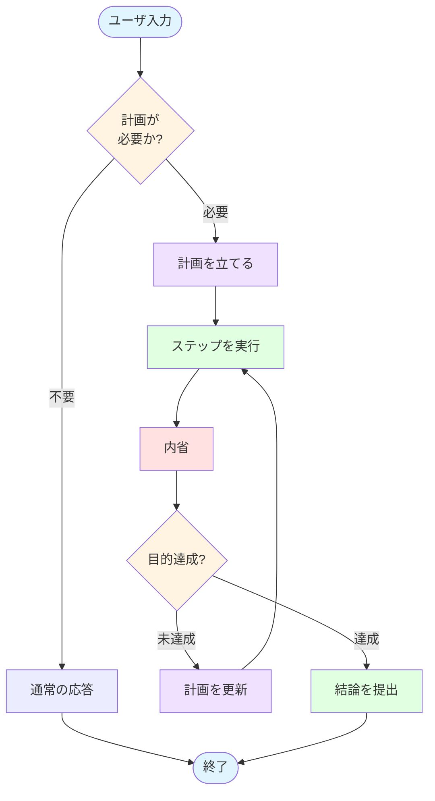

この記事はアドベントカレンダー「Goで作るセキュリティ分析LLMエージェント」の18日目です。

今回のコードは https://github.com/m-mizutani/leveret の [day18-plan-execute](https://github.com/m-mizutani/leveret/tree/day18-plan-execute-impl) ブランチに格納されていますので適宜参照してください。

# 生成AIエージェントの実行における迷走

- LLMの短く明確なタスクだと、以前に実装したFunction Callingのループで問題なく完了してくれる
- しかし、やや複雑な処理だったり、複数の要件が発生するようなタスクだと急に迷走をはじめる
  - 横道にそれはじめて目的を見失う
  - なんか頑張っているがよくわからないことを延々と続ける
- なぜこんなことが起きるのか？
  - プロンプトに目的が含まれていても部分的に忘れる Lost in the middle現象など
    - 入力データが大きくなりすぎると真ん中あたりの情報の優先度が低くなる現象
  - コンテキストが長くなりすぎた結果、ヒストリが compression される過程で目的が見失われてしまう
    - 要約で適切に目的を残すように指示しても、文脈が失われたりしてしまう
      - 大量データを要約しようとすると難しい
    - trimとかだともっと深刻な問題に
  - 直近のヒストリに影響されるので、一度おかしな推論をしたり仮説を立てたりすると、そのまま突き進んでいく
    - そのまま返ってこなくなることもしばしば
- LLMエージェントの

# 生成AIエージェントの行動思考手法

- こうした迷走を防ぐために生成AIエージェントを実行する際にエージェントの行動を制御する手法がいくつか存在する
- LLM Agent Architectures, Reasoning strategiesなどと呼ばれる
- 本アドベントカレンダーでは「行動思考手法」と呼ぶ
  - 行動思考手法は多岐にわたる
- 具体的には、単純にツール実行を繰り返すのではなく、ツール実行の合間にさらに生成AIによるコンテンツ生成を挟み込み、その結果によって次の行動の選択を方法の総評
  - ここまでの要約を与えたり、フルHistoryを与えたりなど手法は様々だが、とにかくタスクの実行とは別に実行方針制御も生成AIでやる、というのがポイント
  - （ここに単純ループと行動思考手法の違いのフローチャートを書く）
- 筆者の認識だとメジャーなものは以下辺り
  - **ReAct (Reason + Act)**:
    - 汎用的に使える思考＋実行を繰り返す手法
    - function callingと比較すると、ReActは思考過程をテキストとしてhistoryに含められる一方、function callingは構造化されたJSON形式で確実にツールを呼び出せる
      - ReActの利点は推論ステップを明示的にプロンプトに示して制御することだが、本質的にはhistory管理の一種である
  - **Plan & Execute**:
    - 計画フェーズと実行フェーズを分離することで計画に沿ったタスクをこなす
    - 安定的に動作する反面、探索的なタスクには弱い
    - 初期計画が静的なため、予期しない状況への適応が困難であり、タスクが順次実行されるため並列化による高速化も制限される
  - **Reflexion**
    - 自己評価・改善ループ型
    - 実行するたびに結果が目的を達成したか？というのを確認し、だめなら内省する
    - それをもとに再実行を繰り返す
    - 探索的な処理に適している
- 研究分野も含めるとより多様な手法がある
  - 今回の記事では各手法の詳細には踏み込まない
  - また最新の研究成果は追随できていない（し、それをここで書いてもあっという間に陳腐化する）
  - 興味がある人は自分で最新の情報を調べてくれ
- 2025年現在の最新のエージェントでは、これらの手法を組み合わせたり、必要に応じて切り替えたりしながら利用している
  - 例えばタスクによって手法を変えるとか
  - ある手法のなかでのツール実行を別の行動思考手法で制御するとか
  - 万能な行動思考手法はなく、最適手法に関しての研究が進んでいる

# Plan & Executeパターンの利用

## セキュリティアラートの分析と Plan & Execute パターン

### Plan & Executeを採用する理由

- 今回のLLMエージェントでは事前に計画を立てて遂行していく Plan & Execute パターンを採用する
  - これは対象とする「セキュリティアラートの分析」というユースケースに依存する

- (1) まずセキュリティアラートが飛んでくる
  - この時点でなにか問題が発生している可能性が示唆されている
    - これにはどのような問題かも（ちょっと考えると）わかるようになっている
  - そして基本的に問題に関する手がかりが記されている
- (2) 次にするべきはその手がかりからそのアラートが実際に影響を及ぼしたのか
  - これは関連するログやシステムの状態などを調べる
  - 同時にそのリソースに関する社内のアクティビティなどを調べる
  - という観点で考えると、実はあまり探索的なことをしていないのである
    - ここでいう「探索的」というのは「新しい情報を取得してそれを元に次の行動を変更・決定する、というのを連続してやるもの」という意味
  - つまりアラートを見た時点で、アクセス可能なデータソースから調査すべき情報というのは概ね定まる
    - もちろんなにか見つけた際に深堀りが必要になったり、期待していたデータが発見されなかったので修正するという事は考えられる
    - しかしまず初手はこれとこれとこれ、みたいに、熟練のアナリストはおおむねあたりをつけられる（と筆者は考えている）
  - という性質から、まず計画を立てることが重要である
    - むしろ一つの事象に囚われてあっちこっちで余計な関心を掘り始めるほうがよくない
- (3) もし影響があると判断された場合は影響の範囲を調べる、というのがエージェントのタスクとなる
  - その場合もそのAlertに関連するリソースや主体がどのような行動をしていたか？というのがまず調べることになる
  - そうすると最初に探すべきキーとDBは容易に推定できるため、これも事前計画と相性がよい
    - もちろんこのタスクについては、そっからさらに深堀りする可能性がある
    - ただそれはタスク全体じゃなくて、個別のタスクの中で深堀りしていくっていういのがポイント
    - この場合はPlan & ExecとReflexionを組み合わせるという技もやりうる
    - ただややこしくなるので、今回はplan & execだけね

### Plan & Execute が適さないユースケース

- ちなみに全く無の状態から始めるタイプの脅威ハンティングだと全く違った戦略になる
  - その場合はそもそも大量のデータからどうやって分析するかの取っ掛かりをいかに作るかが問題
  - こういうケースだと少なくとも初手では生成AIを使わない方がいいかもしれない
    - 例えば従来の機械学習手法などをつかい、怪しい点にまず目星をつける
    - 生成AI・LLMは大量データの処理が弱いという特徴がある
      - まずそもそもコンテキストの限界が小さいため大量のログとか見れない
      - 「異常検知」みたいなタスクに弱い。複数データの中から異常をみつけたり類似をみつけたりということが難しい
      - 具体的に「XXな挙動」として順次ログを与えていくと検知してくれる場合がある
        - しかし今度はコストが問題になる場合が多い
  - このようにLLMエージェントを使った問題解決では（依然として）データをどう扱うのが最適なのか人間がしっかり考える必要がある
  - 脅威ハンティングについて筆者はそこまで専門ではないので割愛

## 全体の流れ

- 大まかに、計画必要有無の判定、計画、実行、内省、最終結果の提出というステップ
- 実行と内省をループし、タスクが完了したら最終結果提出へ遷移する

### (0) まず計画が必要かどうか判定する
- 本来はplan & execute の範疇ではないが結構重要なテクニック
- plan & execute は計画 → 実行 → 反省というループを繰り返すので一ラウンドだけでも数回のLLMクエリが発生する
  - そのため非常に単純な命令やツールを使わないでいいような命令でも、なんでもかんでもplan & executeにすると応答時間がかかる
  - コストの問題もあるが単純にユーザ体験がわるい
  - そこで一番最初にそもそも plan & execute を実施する必要があるかを判定する
  - もし必要無ければ通常の呼び出しで良いことになる
  - これは(1)と同時にやってもよい
  - ポイントとしては過去のヒストリなどの文脈も見る必要がある

### (1) 計画をたてる
- ユーザーからの入力をもとに計画を立てる
- この1度のユーザの入力によって起きる一連の作業を、今回は説明のため「タスク」と呼ぶ
  - 異なる命令は異なるタスク
- この時点でなるべく別途システムプロンプトでコンテキストを与えてあげるとよい
  - AIのロール（セキュリティ分析のサポートをする役目など）
  - 分析の方針を定義する
  - 組織やインフラ、環境に関する情報
  - ログのDBなど、データソースに関する情報
  - ツールのリスト
  - 分析対象のAlertのデータ
- 計画を立てる方針も指示する
  - どういうタスクの分解はよい、悪いという説明
  - 実際の具体例（few-shot）
  - あまり細かく分類しすぎないようにとか
  - ユーザの目的を達成することをちゃんと優先しろとか
  - 存在するツールしか使うなとか
    - 適当なツールをでっち上げはじめる
- 計画を生成する
  - 計画はLLMに生成させる
  - 計画に必要な要素は目的と手順の一覧
    - `goal` ユーザの意図を解釈させる。例えば人間は「〜を調査して」といった場合、
    - `steps` タスクを分解した作業。例えば「〜のDBから関連するログを抽出する」「x.123.4.56の脅威情報を調べる」みたいな粒度で分解する
      - `id` stepの識別子。これは後の反省フェーズで利用する
      - `description` 具体どういうステップかの説明
      - `tools` 利用を期待するツール。これは入れるのが良い場合と悪い場合がある。明確に使うtoolsを限定したい場合はよい。逆に探索要素が入り込む場合は縛りになってしまうことがある。これはプロンプトとのバランス
      - `expected` どのような結果を期待するかの情報をあらかじめ設定させる。これによってそのタスクが目的を達成したのか、それともだめだったのかを判定する指標にする。これは後の計画見直しで利用される

### (2) ステップを実行する

- ステップ実行はこれまでのエージェントのループと同じ
- ポイントとして、履歴の扱いをどうするかという議論がある
  - (a) 全historyを取り込んで残す：
    - エージェントがコンテキストを十分に理解できる
    - 一方で過去に変な行動をした場合などの影響をひきずることになる
    - またコンテキスト消費が激しくなる
    - さらに前のタスクでの影響も受けやすくなる（これは良い面悪い面ある、失敗を繰り返さない可能性があるが、一方で誤った情報を引きずる可能性がある）
  - (b) そのタスク内の他の実行結果をさまって渡す
    - description, 実行結果、得られた情報、、など
    - すでに保持している情報を改めて探すということをしなくなる
    - 一方で細かいコンテキストまでは引き継がれない。失敗した処理が引き継がれないので、同じ失敗をする可能性がある
  - (c) まったく履歴を引き継がない
    - 完全に独立した作業になる
    - まったく影響を受けないが、タスクがかなり具体的に指定されていないとうまく動かないこともありえる
- 諸説あるが今回は折衷案の(b)を採用する
  - タスクによっては(a) or (c)、あるいはもっと別の手段もとりうる

### (3) 内省をする

- ステップ実行によって得られた結果とこれまでの履歴、そしてこのタスクの目的をもちよって内省をする
- この反省・内省ステップをplan & executeに含めるべきかという議論はある（plan & execute & reflection）
- ただ実際はやはり内省を挟んだほうがよい
  - 調査によって新たにわかったことをもとにステップを追加する（これはそんなに無い想定）
  - すでに明らかになって不要になった未完了ステップをキャンセルする
  - タスクの目的がすでに達成されていたら早期終了する
- 一度のクエリを挟むので応答時間が長くなるが、やる価値は大きい
- 基本的に内省に必要なのは以下
  - `archived` 今の完了ステップによてすでに目的を達成したか？
  - `plan_updates` 計画をどう更新するか
    - 既存計画の修正、あるいは追加
    - ここでどのステップを操作するのかで `id` が必要になる
    - 更新の仕方は追加と変更を設ける
    - タスクのキャンセルも変更として扱い、リストには残しておく
      - そうすると同じタスクを追加したり削除したりみたいなのを防げる
- ポイント
  - タスクの更新についてもちゃんとポリシーを与える
    - 対象が見つからない場合無尽蔵に探し続ける
    - どのくらいまで深追いするか明示しておく
    - あと失敗したやつは忘れろとか、だめだったことを二度やるなとかそのあたりも指示しておいたほうがいい
  - プラン作成時の指示・制約と平仄をそろえておく
    - これによって初期作成とあとから追加されるタスクの整合がとれる

### (4) 結論の提出

- `archived` が `true` になったらそこで完了してユーザに報告する結論をまとめる
- 要するに思考を経て得られた結論となる
- これまでの各ステップの実行結果をもとにする

### 今回の対象外機能

- 並列実行は今回扱わない
  - タスク分解することのメリットはタスクを独立
- これをやるためには依存関係を扱う必要がある
  - 依存関係にもとづく並列実行は単純に実装ロジックがそれなりにややこしい
  - また競合関係のタスクがないかみたいなことも考慮しなければならない
    - これが生成AIに正しく判定できるのかはあやしい
  - 今回はplan & executeの方式を学ぶために、並列実行はout of scopeとする
    - ただし今回はおもに参照系で競合も発生しないため、興味のある人は実装してみても良いと思う

# まとめ

- plan & execute のような高度な制御は、方法論は確立していても実際にはこまかい調整をする余地が様々ある
- これはユースケースやタスクによってもことなるので意外と簡単な話ではない
- さらに難しいのは利用するユーザのメンタルモデルにも依存する
  - ユーザが期待することとエージェントの機能や足回りがうまく合致していないと効果が期待できない
- このあたりはまだ手法が確立しているわけではない
- 効果的なエージェントをつくるには実際に使ってみていろいろ調整していくしかない
- 次回は実際の実装についてみていく