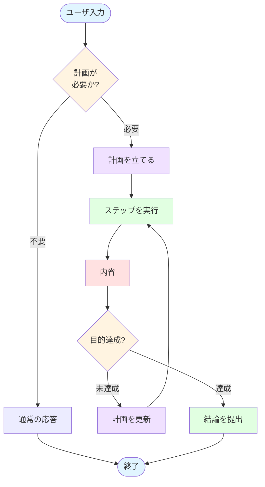

この記事はアドベントカレンダー「[Goで作るセキュリティ分析LLMエージェント](https://adventar.org/calendars/11354)」の19日目です。

今回のコードは https://github.com/m-mizutani/leveret の [day19-plan-execute](https://github.com/m-mizutani/leveret/tree/day19-plan-execute-impl) ブランチに格納されていますので適宜参照してください。また今回は前日の設計に基づいた実装になっているため、先にそちらの記事を閲覧されることをおすすめします。

# Plan & Executeの実装の大まかな流れ

- まず具体的な処理の流れをみていく
- 昨日提示したこのループを表現するコードを見ていく


```mermaid
flowchart TD
    Start([ユーザ入力]) --> Judge{計画が<br/>必要か?}
    Judge -->|不要| Simple[通常の応答]
    Judge -->|必要| Plan[計画を立てる]

    Plan --> Execute[ステップを実行]
    Execute --> Reflect[内省]

    Reflect --> Check{目的達成?}
    Check -->|未達成| Update[計画を更新]
    Update --> Execute

    Check -->|達成| Report[結論を提出]

    Simple --> End([終了])
    Report --> End

    style Start fill:#e1f5ff
    style End fill:#e1f5ff
    style Judge fill:#fff4e1
    style Check fill:#fff4e1
    style Plan fill:#f0e1ff
    style Execute fill:#e1ffe1
    style Reflect fill:#ffe1e1
    style Update fill:#f0e1ff
    style Report fill:#e1ffe1
```


- `sendWithPlanExecute` がPlan & Executeの中核をなす実装
- 既存の `Send` を壊さないよう、別立ての実装にしている

```go:pkg/usecase/chat/session.go
// sendWithPlanExecute executes the plan & execute mode
func (s *Session) sendWithPlanExecute(ctx context.Context, message string) (*PlanExecuteResult, error) {

	// Initialize plan & execute components
	planGen := newPlanGenerator(s.gemini, s.registry)
	conclusionGen := newConclusionGenerator(s.gemini)

	// Step 1: Generate plan
	fmt.Printf("\n📋 計画を生成中...\n")
	plan, err := planGen.Generate(ctx, message, s.alert)
	if err != nil {
		return nil, goerr.Wrap(err, "failed to generate plan")
	}
	displayPlan(plan)
```

- まずここまででPlanを作成し、ユーザに提示する

```go
	// Step 2-4: Execute plan with reflection loop
	results, reflections, err := executeStepsWithReflection(ctx, s.gemini, s.registry, plan)
	if err != nil {
		return nil, err
	}
```

その後、 `executeStepsWithReflection` でツール実行とPlan修正（reflection）のループに入る

```go
	// Step 5: Generate conclusion
	fmt.Printf("\n━━━━━━━━━━━━━━━━━━━━━━━━━━━━━━━━━━━━━━━━━━━━━━━━━━━━━\n")
	fmt.Printf("📝 結論を生成中...\n")
	fmt.Printf("━━━━━━━━━━━━━━━━━━━━━━━━━━━━━━━━━━━━━━━━━━━━━━━━━━━━━\n\n")

	conclusion, err := conclusionGen.Generate(ctx, plan, results, reflections)
	if err != nil {
		return nil, goerr.Wrap(err, "failed to generate conclusion")
	}
```

- 最終的にループから得られた情報をもとに結論を生成する
- では設計にあった(0)のPlan & Executeを使うかどうかの判定はというと、これは `Send` 側に実装している
- もとの `Send` の冒頭で問い合わせるようにしている
- これによって通常処理か、あるいはplan & executeかを自動的に選択している

```go
func (s *Session) Send(ctx context.Context, message string) (*genai.GenerateContentResponse, error) {
	// Check if plan & execute mode should be used
	if shouldUsePlanExecuteMode(ctx, s.gemini, message, s.history.Contents) {
		// Use plan & execute mode
		result, err := s.SendWithPlanExecute(ctx, message)
		if err != nil {
			return nil, goerr.Wrap(err, "Plan & Execute mode failed")
		}
		// Plan & Execute mode succeeded
		// Convert to response format (create a synthetic response)
		return s.createResponseFromPlanExecute(result), nil
	}
```

- 判定にはこういうプロンプトを送る
- シンプルにyes or noで判定させている
  - もちろん構造化して boolean で答えさせるとかでもOK
  - どういう処理はPlan & Executeがよく、どういうものが直接ループがよいかという事例をだして判断させる
- これでyesが返ってきたらplan & executeで実行し、そうでなければ普通のループへ分岐する

```go
// shouldUsePlanExecuteMode determines if plan & execute mode should be used
func shouldUsePlanExecuteMode(ctx context.Context, gemini adapter.Gemini, message string, history []*genai.Content) bool {
	// Use LLM to judge if the message requires systematic multi-step execution
	systemPrompt := `You are evaluating whether a user's request requires systematic multi-step execution (Plan & Execute mode) or can be handled with direct conversation.

Plan & Execute mode is needed when:
- Multi-step tasks or operations are required
- Complex tasks combining multiple tools or actions
- User requests deep or thorough work ("in detail", "thoroughly", "investigate", "analyze")
- Systematic data collection or processing is necessary

Plan & Execute mode is NOT needed when:
- Simple questions or confirmations
- Questions about already displayed information
- Simple viewing or checking
- Single-step operations
- Follow-up questions in an ongoing conversation

Respond with ONLY "yes" or "no".`
```

- ここまでが全体の流れ
- ここから各処理を見ていく

# 履歴の管理

- こういう「行動思考手法」では履歴をどう管理するかがかなりポイント
  - ここまで見てきた通り履歴は文脈を伝える重要な方法だが、過去の判断に引きずれられる、コストが増加する、プロンプト全体が長くなりコンテンツ生成の精度がぼやけるなどのデメリットも有る
  - 必要なところでのみ履歴を投入すべき
- 計画生成、実行、内省、結論生成でそれぞれアプローチが異なる
- 大きな考慮点は以下
  - 処理実行時にこれまでの履歴を利用するか？
    - これまでの履歴を使うかどうかだが、一部の履歴だけ（例えばタスク内のものだけ）つかうというのもありえる
  - 処理完了時にその履歴を引き継ぐか？
    - 残す必要がなければそのまま履歴を捨てるというのもありえる
- これは様々な調整がありえるので一概には正解がないが、おおよその方向性としては重要
- 表にまとめると例えばこういう感じ
  - これはあくまで一例でもっと違うやりかたも全然ありえる
  - Conclusionは履歴利用Noにしているがこれは全部の履歴は使わず、そのときのタスクの結果だけを利用するということを

フェーズ	History	履歴引き継ぎ	理由
Planning	✅ YES	❌ NO	内部分析プロセス、ContextSummaryに埋め込むため
Execution	✅ YES	✅ YES	ツール実行結果を保持、後続タスクで参照
Reflection	❌ NO	❌ NO	内部分析、ツール重複検出に履歴必須
Conclusion	❌ NO	✅ YES	最終回答、タスク結果のみで十分


# Plan & Execute の各処理の実装

## 計画生成

```md
# Plan Generation

## Your Role

You are a security analyst assistant. Your role is to support security alert analysis and create systematic plans for various tasks.
```

- まずどういう振る舞いを期待しているのかを明確にする
- ただしこの場面では分析者そのものではなく、「サポートする立場」「プランを立てるものである」という役割をあたえる
  - 実際に実行するわけではないのでそこはちゃんと分ける
  - このセッションはPlan作成のみを実施し、その後そのまま破棄する
- つづいてユーザのリクエストおよびAlertに関する情報を記載する
  - ユーザのリクエストは他の情報に埋もれると行けないのでセクションを設けるなどして強調しておく必要がある
  - アラートについては構造体をそのまま掲載してもよいがある程度の説明を加えておくとなおよい

```md
## Task Philosophy

When the user requests analysis or investigation, typical goals include:

1. **Alert Validation**: Determine if it's a false positive or true positive (actual threat)
2. **Impact Assessment**: Identify affected resources and users
3. **Evidence Collection**: Gather supporting evidence from logs and external sources
4. **Action Recommendation**: Provide clear next steps

However, adapt your plan to match the user's specific request - not all tasks are investigations.
```

- 実行のための方針も入れておく
- どういう行動を優先してほしいのか、何を知ろうとしているのかなどを事前に定義しておく
  - これは汎用的なplan & execエンジンだともっと違う形になる
  - タスクがある程度絞れているからこそ、どういう行動を期待するかを具体的に指示できるというメリットがある

```md
## Available Tools

You must only use tools from this list. Do not reference or plan to use any tools not listed below.

Available tools:

{{range .Tools}}
{{.}}
{{end}}
```

- ツールの一覧もプロンプトで与える
- これは Function Calling を設定しないというのがポイント
- なぜならここではツールを実行しないから
- しかしツールの情報がないと何ができるかわからない → 実行計画がたてられないという問題がある
- 場合によっては存在しないツールを使おうとして勝手にこける
- ちゃんとした計画を練らせるためにも、ツールに限らず事前情報を過不足なく伝えるのが重要

```md
### Example Patterns

**Vague Request** ("investigate this alert"):
→ 2-3 steps: IOC checks, log review, pattern search
→ Include ALL investigation angles you think might be useful - you won't get a second chance

**Specific Question** ("is this IP bad?"):
→ 1 step: Direct query to available threat intel tool
```

- 計画を立てるパターンもいくつか例示しておくとよい
- これによって利用者が想定する計画の建て方との齟齬が小さくなる
  - 例えば色々調べてほしいのに狭い範囲しか探索しようとしなかったり
  - どうでもいいことにめちゃくちゃ長い計画を立てたり
- このあたりは利用者のメンタルモデルとの調整でもある
  - 例えばコーディングエージェントの動きを知っているといろいろよしなにやってほしくなる
  - 逆に各LLMサービスのWebチャットだと一問一答形式になるので、なるべく短くしたくなると思われる

```json
{
  "objective": "Clear statement of investigation goal",
  "steps": [
    {
      "id": "step_1",
      "description": "Specific action to take",
      "tools": ["tool_name_1", "tool_name_2"],
      "expected": "What this step should achieve"
    }
  ]
}
```

- 最後に出力形式を例示しておく
- このあとスキーマでも与えるのでなくても良いかもだが、例を入れておくとより精度があがる
- とくに入力が自由形式のやつはイメージさせやすくなると思われる
  - Descriptionでいれるという手もあるが、どういうアプローチが正解なのかはモデルなどにも依存しそう
- 別途、例にのっとったスキーマも定義する
  - こっちはこっちでRequired/Optionalや型を示すなどの役割がある
- Objectiveもユーザのリクエストから特定する
  - ユーザの発現というのは非常に曖昧なときもある
  - そのためまずそのセッションにおけるタスクを明確化する
  - この目的をつかって、各ステップ終了時に「目的が達成できたか」を確認する
  - それによりセッションが長くなっても迷走しなくなる

```go
// Create content with history + new request
contents := make([]*genai.Content, 0, len(history)+1)
contents = append(contents, history...)
contents = append(contents, genai.NewContentFromText(buf.String(), genai.RoleUser))

// Generate plan
resp, err := p.gemini.GenerateContent(ctx, contents, config)
if err != nil {
	return nil, goerr.Wrap(err, "failed to generate plan")
}
```

- この計画生成ではこれまでの履歴を与えることが重要
  - なぜなら履歴がないと、すでに調査して判明している情報を再度探しにいくことになるから
  - 場合によっては追加調査無しで回答することもできる
- 一方でこの履歴は引き継ぐ必要がない

## 内省

- 実行に関してはこれまでも扱ってきたので割愛
- 実行結果を得たらそれに基づいて計画を修正させる
  - 最初の目的を示す、これをもとに目的が達成されたかどうか判定する
  - 以下のように、これまで完了したStepとその結果、まだ未完了のStepを示す
- そのうえで計画の修正を提案させる

```md
# Step Reflection

You need to reflect on the execution of an investigation step and determine if plan adjustments are needed.

## Investigation Objective

**Goal**: {{.Objective}}

## Step Information

**Step ID**: {{.StepID}}
**Description**: {{.StepDescription}}
**Expected Outcome**: {{.StepExpected}}

## Current Plan Status

**Already Completed Steps**:
{{if .CompletedSteps}}
{{range $index, $step := .CompletedSteps}}
{{add $index 1}}. {{$step}}
{{end}}
{{else}}
(None yet)
{{end}}

**Pending Steps**:
{{if .PendingSteps}}
{{range $index, $step := .PendingSteps}}
{{add $index 1}}. {{$step}}
{{end}}
{{else}}
(None)
{{end}}

Do not add steps that duplicate already completed or pending steps. Always check the lists above before adding new steps.
```

- 内省の回答は以下のようにする
  - `achieved` すでに目的を達成したかどうか判定する。ステップの途中でもすでに目的が達成されていたら無駄に実行を重ねる必要がないので
  - `insights` 全体の実行計画には影響しないが、最終的な結論を出すときに利用するもの。データなどに関する解釈などが入る
  - `plan_updates`: プランの更新。追加・更新・削除を選択できてさらにどのように変更するべきかの指示も表記する
- この結果に基づいてデータ構造内のplanを更新し、それに応じて次の実行をする
  - もし `archived` になっていたりplanが全て実行済みだったら、結論提出のフェーズに入る

```json
{
  "achieved": true/false,
  "insights": [
    "New insight or discovery 1",
    "New insight or discovery 2"
  ],
  "plan_updates": [
    {
      "type": "add_step",
      "step": {
        "id": "step_2a",
        "description": "Description of additional investigation",
        "tools": ["tool_name"],
        "expected": "Expected outcome"
      }
    }
  ]
}
```

## 結論提出

- 最終的な結論をだしてユーザにフィードバックさせる
  - 調査系のタスクなら調査結果となる
  - 変更系のタスクなら単純に報告とか
  - ただしセキュリティ分析の文脈ではやはり調査系が多いので、そちらに振ったプロンプトチューニングでよい
- あたえるべき情報は今回のタスクで得られた一連の情報
  - 目的、これはユーザからの直接のクエリではなくLLMで整理をした方
  - 各ステップと実行結果、およびステータス
    - ステータスは実行しなかった、みたいなのも含まれるので
  - 内省の結果
    - 特にinsightsなど
    - Archivedと判定したかどうか

```md
# Conclusion

You have completed all steps of the task. Now synthesize the findings into a comprehensive conclusion.

## Objective

{{.Objective}}

## Steps Executed

{{range $index, $step := .Steps}}
### Step {{add $index 1}}: {{$step.ID}}
**Description**: {{$step.Description}}
**Status**: {{$step.Status}}
{{end}}

## Step Results

{{range .Results}}
### {{.StepID}}
**Success**: {{.Success}}
**Findings**:
{{.Findings}}

{{end}}

## Reflections

{{range .Reflections}}
### {{.StepID}}
**Achieved**: {{.Achieved}}
**Insights**:
{{range .Insights}}
- {{.}}
{{end}}
{{end}}
```

- これをもとに最終的な結論を生成させる
- 例えば以下のうにマークダウンにする
  - 調査結果とある程度割り切ってしまえばこのようにフォーマットを指定するのも全然あり
  - より汎用的にするのであればフォーマットは指定しない方が良い
  - あるいはプログラマティックに処理したいという要望があるなら構造化出力にするというのも全然あり
  - いずれにせよ、処理の特性などに合わせて調整するのがよい

```md
## Response Format

Respond directly with markdown-formatted text in Japanese. Do not wrap it in JSON.

**Example**:
\`\`\`
# 結論

## サマリー
このアラートは...

## 主要な発見
- 発見1
- 発見2

## 評価
...
```


# まとめ

Plan & Execute パターンの実装を通じて、エージェントシステムにおける重要な設計原則が見えてきました。それは**適切な情報を適切なタイミングで提供する**ということです。

このパターンの核心は、実行フェーズごとに異なる履歴管理戦略を採用している点にあります。計画生成では過去の履歴を参照して重複を避け、実行では結果を蓄積し、内省では現在のステップに集中し、結論では全体を俯瞰する――この使い分けが、効率的かつ精度の高い分析を可能にします。

また、計画生成時に Function Calling を設定せず、代わりにツール一覧をプロンプトで提供するというアプローチも示唆に富んでいます。これは「その処理に本当に必要な情報は何か」を常に問い直す姿勢の表れです。LLM に期待する振る舞いを明確にし、それに必要十分な情報だけを与えることで、生成品質とコストの両面で最適化が図れます。

あなたが独自のエージェントを設計する際も、各フェーズで「何を知っていれば判断できるのか」「その情報はどこから得られるのか」を分解して考えることで、より洗練されたシステムに近づくはずです。次回は Plan & Execute パターンの実行例を見ながら、実際の動作と改善点について考察していきます。
