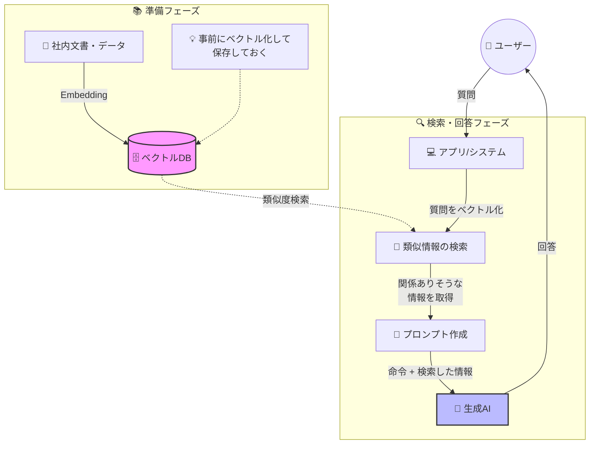

この記事はアドベントカレンダー「[Goで作るセキュリティ分析LLMエージェント](https://adventar.org/calendars/11354)」の20日目です。

今回のコードは https://github.com/m-mizutani/leveret の [day20-embedding](https://github.com/m-mizutani/leveret/tree/day20-embedding) ブランチに格納されていますので適宜参照してください。

# Embeddingについて

## Embeddingとはなにか

- 一言で言うと「言葉・文章の意味のベクトル化」
- 似たような意味の言葉・文章同士が近いベクトルとなるような計算方法
- 例
  - ペット <-> 犬（近い）
  - 犬 <-> 宇宙（遠い）
  - ペット <-> 宇宙（遠い）
- 単語や文章のベクトル化の技術は生成AI以前から研究されてきた
- 単語や文章をベクトル化する技術を総称してEmbeddingと呼ぶ
  - 初期のEmbedding技術（word2vec、GloVeなど）は単語単位のベクトル化が中心
  - 「文脈によって意味が変わる多義語に弱い」「文全体のベクトル化が苦手」という制約があった
- その後、文章の流れ（文脈）を捉えるために RNN や LSTM といったモデルが登場
  - 文全体の意味を扱えるようになってきたが、長文になると苦手という課題が残っていた
- 新しく登場した Transformer により、文中の意味のつながりを効率良く理解できるようになった
  - Transformerは現状のLLMにおける重要な基礎技術の一つ。BERTやGPTなどの大規模言語モデルがこの仕組みを採用
    - そのためLLMサービスと一緒に提供されることが多い
      - ということで例えばGemini、OpenAIはそれぞれEmbeddingの機能を提供している
      - Claudeは2025年現在ではEmbedding機能を直接提供しておらず、[voyage](https://www.voyageai.com/)を利用することを推奨している
  - これによって文脈を考慮した高精度なEmbeddingが一般的になった
  - 詳しい理論はここでは扱わないので、気になる人は調べてみてね

## RAG（Retrieval Augmented Generation）とはなにか

- 主にEmbedding機能を活用し、LLMへのプロンプト作成時に必要となる情報を検索し、それらをもとにプロンプトを拡充する技術・フレームワークの総称
  - （これまでにも解説してきた通り）LLMはコンテキスト限界の問題がある
  - そのため関連する情報を事前に全て入力してから回答を出力するのは難しい
  - そこで質問文から意味の近いデータを検索して、それを利用して必要な知識を拡充したプロンプトを組み上げて回答させる、という一連の処理をRAGと呼んでいる
  - 検索の手法には様々あるが、そこでEmbeddingを活用することがおおい
  - 最終的に「プロンプト」を拡充させるのがポイント
- 一時期はコンテキスト限界の問題を一挙に解決する技術のようにもてはやされていたが、さらにLLMの利用範囲が拡大した結果、実際には解決できる問題は限られている
  - 出力すべき内容がユーザの入力とダイレクトに結びつく知識・事実情報などであれば有用である
    - これは一問一答形式のLLMチャットでは特に有効だった
    - 特にユーザーの質問にそのまま回答する系のタスク
  - しかし現在のLLMエージェントのように複雑なタスクの処理において必ずしも活用できるとは限らない
    - 例えば今回のセキュリティ分析もログやデータをAPIなどを経由して取得する必要がある
    - ユーザの入力に対して知識や事実情報を補完することが有用ではないケースも多い
- そのため、RAGそのものについてはLLMエージェントの目的に応じて使ったり使わなかったりということになる
  - 今回のセキュリティ分析では従来のRAGはあまりそぐわない
    - ユーザの入力から汲み取れる補完情報があまりない
    - しかしEmbeddingの技術は活用のしがいがあるのでそれは有効活用する



# セキュリティ分析におけるEmbeddingの利活用

## いわゆるRAGとしての活用は難しい

- 先述した通りセキュリティ分析のユースケースでは、ユーザが入力した内容に対するRAGは効果が薄いと考えられる
- 必要に応じて拡充する知識というのがあまりない
  - 組織内のドキュメントなどを大量に事前にベクトル化するというような利用方法はあまり思いつかない
  - 組織ポリシーやサービス環境の情報などを独自に入力するというのはある
    - しかしそれもそんなに大量のデータを扱うというのは考えにくい
    - ポリシーやサービスに関する知識なら事前にプロンプトに入れておけばよい範囲だったりもする
    - もし大量のポリシーやサービスに関する知識があるなら、それを適宜与えたいというユースケースは考えられる
      - ただしユーザの入力から導出するのは結構難易度高い
      - どちらかというとツールとして検索システムを提供する方が現実的
        - ただこれはEmbeddingをベースにした検索である必要性は特になく、例えばドキュメント管理SaaSの検索機能を使えば良い
          - 既存の検索機能がダメダメな場合、代替の検索システムを用意する過程でEmbeddingを活用するは全然あり
- 「意味的な近さ」が使われないようなデータを取り扱う
  - 代表的なのがIoC（Indicator of Compromise）に関連するようなIndicator。IPアドレス、ホスト名、ハッシュ値など
    - これらは1文字違っただけでまったく異なる意味になってしまう
    - 曖昧な検索には不向き
- これらの理由からセキュリティ分析のために、プロンプト生成にEmbeddingを利用するユースケースは筆者の経験上はほとんどない
  - むしろあったら教えて下さい

## 類似情報の検索機能としては有用

- 一方でEmbeddingを使った類似検索自体はかなり有用性の幅が広い
- 主に類似するアラートの検索など過去事例検索
- アラートは構造化データだがJSONに変換したものは普通にEmbeddingでベクトル化できる
- 例えば「時刻、IPアドレスなどのパラメータが少しズレているが概ね似たようなアラート」というのを手軽に検索できるようになる

### ユースケース1: ツールとして機能提供しエージェントに検索させる

- エージェントが必要に応じて検索できるようにしておく
- これによって例えばそのアラートについての影響を分析するといったとき、過去に発生した似たようなアラートがどのように処理されたかを容易に確認できるようになる
- もちろんパラメータを条件として検索させるという方法もあるが、これは実装が結構面倒くさい
  - 例えば（ログ検索同様）スキーマ、フィールドのメタ情報、サンプル値などをちゃんと伝える必要がある
  - またごく一部だけ一致しているがほかは全然違うみたいなものを引っ張ってくる可能性もある
  - もちろん意図してこのような検索を設置しておくのはよい
- なので「似たようなアラートを検索できる」ということでツールとして提供しておくと有用
- 注意点としては過去のアラートがある程度ちゃんと処理されている必要がある
  - 雑に扱われているとそれを見つけたところで得られる情報は少ない
  - ちゃんとCloseするときなどに理由などを記載するようにしておくと、それを有効活用できる

### ユースケース2: 類似するアラートを一括で処理する、あるいは統合する

- 実はこっちのほうが実運用では非常に強力
- セキュリティアラート監視あるある
  - 検知設定が間違っていてアラートが暴発する
  - たまたまなんらかの攻撃にさらされてアラートが大量発生する
  - 検知システム側のロジックが変更された影響でアラートが暴発する
- なんらかの要因で大量発生した（影響がないと確信できる）アラートを全部処理しないといけない
  - ひどいときは数千件とかになる
  - これを1件ずつ確認してクローズするのは苦痛
  - しかしまとめてクローズできるかというとそれも難しい
    - しれっと1件全然関係ないアラートが混ざっていないか？
    - 似たようなアラートであれば大丈夫と考えられるが…
    - キーワードで検索すればいいかと思いきや、同じ種類のアラートだがまったく違うやつが混ざっている、、というのもありえる
  - これの処理が面倒でセキュリティ監視が滞るというのも珍しくない（筆者はよく経験していた）
- ということでこれをEmbeddingを使って解決する。例えばこうやって一括クローズ対象のアラートを検索できる
  - アラートの類似度（コサイン距離）は0〜2で表現される（0ほど近い）。
  - しきい値を設けて類似度で足切りする
    - 例えば0.1以下とするとかなり近しいアラートになる
  - そこからさらにキーワードでフィルタをかける
    - これは「似てはいるが、意図していないアラートが紛れていないか」を確認するため
    - もちろんそれでも紛れ込む可能性は0ではないが、そこまで心配なら目視で確認するしかない
  - というのをすると概ね意図した関連アラート一覧というものが拾える
    - これをクローズするなり、別のものにマージするなりすればシステム上まとめて処理できる
- これは作業時間的にも精神的負担からもかなり馬鹿にならない効率化になる

# Embeddingの実装

- 今回はユースケース2の類似アラートを検索するところまで実装する
- そのあとクローズしたりマージしたりみたいな処理は自由に実装してみて
- ツールとして検索するのも基本的には同じなので今回は説明を割愛

## firestoreのindex作成

- まずfirestoreで使う場合、Indexを作成する必要がある
- 以下コマンドを実行
  - フィールド名、ベクタの次元数はこの時点で決定しておく必要がある
- また重要なポイントとしてそのフィールドが存在しない、あるいは0ベクタのレコードが存在すると、Firestoreでは検索に失敗する点に注意
  - そのためEmbeddingを使うのであれば以下のどれかの対応が必要になってしまう
    - 全く新しいcollectionを使う
    - collectionの既存レコードのEmbeddingをあと埋めする

```bash
gcloud firestore indexes composite create --project=your-project --database=your-database --collection-group=alerts --query-scope=COLLECTION --field-config=vector-config='{"dimension":"768","flat": "{}"}',field-path=Embedding
```

## Embeddingの生成

- 生成は非常に簡単
- geminiの場合は `EmbedContent` を呼び出すだけ
- 次元数だけに注意
  - これはfirestore側の次元数に合わせる必要がある
  - 次元数が多ければ多いほどより精緻に表現できる
  - 体感的には500程度あれば十分

```go:pkg/adapter/gemini.go
func (g *GeminiClient) Embedding(ctx context.Context, text string, dimensions int) (firestore.Vector32, error) {
	config := &genai.EmbedContentConfig{}
	if dimensions > 0 {
		d := int32(dimensions)
		config.OutputDimensionality = &d
	}

	resp, err := g.client.Models.EmbedContent(ctx, g.embeddingModel, genai.Text(text), config)
	if err != nil {
		return nil, goerr.Wrap(err, "failed to embed content")
	}

	if len(resp.Embeddings) == 0 {
		return nil, goerr.New("no embeddings returned")
	}

	return firestore.Vector32(resp.Embeddings[0].Values), nil
}
```

## Alertへの埋め込み

```go
	// Generate embedding vector from original alert data
	embedding, err := u.gemini.Embedding(ctx, string(jsonData), 768)
	if err != nil {
		return nil, goerr.Wrap(err, "failed to generate embedding")
	}
	alert.Embedding = embedding

	if err := u.repo.PutAlert(ctx, alert); err != nil {
		return nil, err
	}
```

- PutAlertする直前に差し込んでいるだけ
- Go実装におけるポイントは `firestore.Vector32` あるいは64を使うこと
- これを使わないとただしくベクタ検索用のフィールドとして認識されない

```go
type Alert struct {
	ID          AlertID
	Title       string
	Description string
	Data        any
	Attributes  []*Attribute
	Embedding   firestore.Vector32
```

## Alertの検索

```go:pkg/repository/firestore.go
func (r *Firestore) SearchSimilarAlerts(ctx context.Context, embedding []float64, threshold float64) ([]*model.Alert, error) {
	client, err := r.getClient(ctx)
	if err != nil {
		return nil, err
	}

	// Convert []float64 to firestore.Vector32
	vector32 := make(firestore.Vector32, len(embedding))
	for i, v := range embedding {
		vector32[i] = float32(v)
	}

	// Build vector query with distance threshold
	query := client.Collection(alertCollection).
		FindNearest("Embedding", vector32, 1000, firestore.DistanceMeasureCosine, &firestore.FindNearestOptions{
			DistanceThreshold: &threshold,
		})

	// Execute query
	iter := query.Documents(ctx)
	defer iter.Stop()
```

- `FindNearest` という条件で動作する
- ベクタの距離の計算にはユークリッド距離、コサイン類似度、ドット積が選べる
- Embeddingの類似度を図るにはコサイン類似度を使うのが良いとされている
  - 詳しくは調べてくれ

```go
```

- `similar` コマンドを実装して類似アラートを表示するようにする
- 指定されたIDのアラートを取得して、それを取得してからそこのEmbeddingの値を使って類似するものを検索する
- 取得した結果からさらにキーワードでフィルタする
  - これによって意図しないアラートが混入するのを防ぐ

```go:pkg/cli/similar.go
// Get the source alert
sourceAlert, err := repo.GetAlert(ctx, model.AlertID(alertID))
if err != nil {
    return goerr.Wrap(err, "failed to get source alert")
}

if len(sourceAlert.Embedding) == 0 {
    return goerr.New("source alert does not have an embedding vector")
}

// Search for similar alerts with threshold
similarAlerts, err := repo.SearchSimilarAlerts(ctx, sourceAlert.Embedding, threshold)
if err != nil {
    return goerr.Wrap(err, "failed to search similar alerts")
}

// Filter alerts
var filtered []*model.Alert

for _, alert := range similarAlerts {
    // Skip the source alert itself
    if alert.ID == sourceAlert.ID {
        continue
    }

    // Apply keyword filters (AND condition) on alert data
    if len(filters) > 0 {
        // Marshal alert data to JSON for filtering
        dataJSON, err := json.Marshal(alert.Data)
        if err != nil {
            return goerr.Wrap(err, "failed to marshal alert data", goerr.Value("alert_id", alert.ID))
        }
        dataStr := string(dataJSON)

        allMatch := true
        for _, filter := range filters {
            if !strings.Contains(dataStr, filter) {
                allMatch = false
                break
            }
        }
        if !allMatch {
            continue
        }
    }

    filtered = append(filtered, alert)
}
```

## 実行例

以下は、あるアラート（暗号通貨マイニング検出）に対して類似アラートを検索した実行例です。

### 閾値0.1の場合

```bash
$ go run . similar -i 69a6df97-b36f-49d4-87bb-3643246b4a4c -t 0.1
Found 2 similar alerts for 69a6df97-b36f-49d4-87bb-3643246b4a4c (Cryptocurrency Miner (XMRig) Detected on 'web-server-prod-01' due to CVE-2023-32784):

1. 8344452d-bdb9-4e64-9121-b1b2b0d14744 (distance: 0.0000)
   Title: Cryptominer (XMRig) Detected on Instance 'web-server-prod-01'
   Description: A cryptocurrency mining software (XMRig) has been detected running on Compute Engine instance 'web-server-prod-01'. This instance is connecting to known Monero mining pools and consuming significant CPU resources, indicating a potential compromise via CVE-2023-32784 from an attacker in Romania. Immediate investigation and remediation are required to prevent further resource abuse and potential data exposure.

2. a859cb2f-9392-4ceb-9420-c554f9b63766 (distance: 0.0120)
   Title: Cryptocurrency Mining Detected on Compute Engine Instance
   Description: Cryptocurrency mining software (XMRig) has been detected running on the 'web-server-prod-01' instance, consuming 98.5% CPU resources. The instance is connecting to a known Monero mining pool, indicating a potential compromise and resource abuse.
```

閾値を0.1に設定した場合、2件の類似アラートが見つかりました。1件目（`examples/alert/scc.json`）はdistanceが0.0000でほぼ同一の内容、2件目（`examples/alert/scc_mini.json`）はdistanceが0.0120で非常に類似した内容となっています。

### 閾値0.01の場合

```bash
$ go run . similar -i 69a6df97-b36f-49d4-87bb-3643246b4a4c -t 0.01
Found 1 similar alerts for 69a6df97-b36f-49d4-87bb-3643246b4a4c (Cryptocurrency Miner (XMRig) Detected on 'web-server-prod-01' due to CVE-2023-32784):

1. 8344452d-bdb9-4e64-9121-b1b2b0d14744 (distance: 0.0000)
   Title: Cryptominer (XMRig) Detected on Instance 'web-server-prod-01'
   Description: A cryptocurrency mining software (XMRig) has been detected running on Compute Engine instance 'web-server-prod-01'. This instance is connecting to known Monero mining pools and consuming significant CPU resources, indicating a potential compromise via CVE-2023-32784 from an attacker in Romania. Immediate investigation and remediation are required to prevent further resource abuse and potential data exposure.
```

閾値を0.01に下げると、より厳密な類似度判定となり、ほぼ同一の内容のアラート（`examples/alert/scc.json`）のみが抽出されました。このように閾値を調整することで、検索の精度をコントロールできます。

# まとめ
