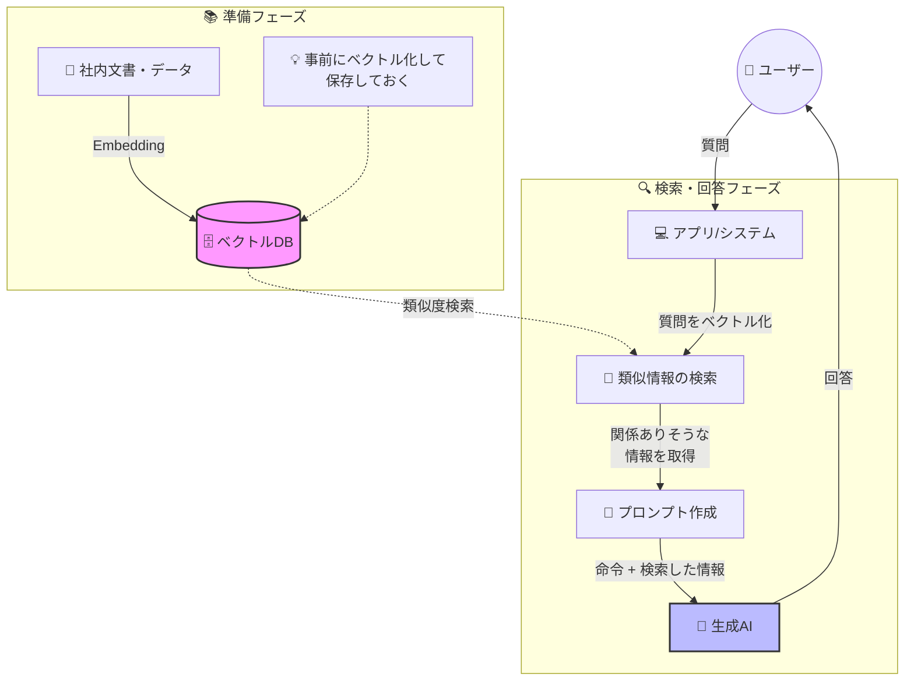

この記事はアドベントカレンダー「[Goで作るセキュリティ分析LLMエージェント](https://adventar.org/calendars/11354)」の20日目です。

今回のコードは https://github.com/m-mizutani/leveret の [day20-embedding](https://github.com/m-mizutani/leveret/tree/day20-embedding) ブランチに格納されていますので適宜参照してください。

# Embeddingについて

## Embeddingとはなにか

Embeddingとは、一言で言えば「言葉や文章の意味をベクトル化する技術」です。似た意味を持つ言葉や文章同士が、ベクトル空間上で近い位置に配置されるように計算される仕組みとなっています。たとえば「ペット」と「犬」は意味的に近いためベクトルの距離も近く、「犬」と「宇宙」は意味が離れているためベクトルの距離も遠くなります。同様に「ペット」と「宇宙」も遠い関係となります。

こうした単語や文章のベクトル化技術は、生成AIが登場する以前から長く研究されてきました。初期のEmbedding技術であるword2vecやGloVeなどは、単語単位のベクトル化を中心としていましたが、文脈によって意味が変わる多義語への対応が弱く、文全体のベクトル化も苦手という制約がありました。

その後、文章の流れ（文脈）を捉えるためにRNNやLSTMといったモデルが登場し、文全体の意味を扱えるようになりました。しかし長文になると精度が落ちるという課題が残っていました。

この状況を大きく変えたのがTransformerの登場です。Transformerによって文中の意味のつながりを効率良く理解できるようになり、文脈を考慮した高精度なEmbeddingが実現されました。TransformerはBERTやGPTなどの大規模言語モデルにも採用されている現在のLLMにおける重要な基礎技術の一つです。このため、LLMサービスと一緒にEmbedding機能が提供されることが多くなっています。たとえばGeminiやOpenAIはそれぞれEmbedding機能を提供しています。一方、Claudeは2025年現在ではEmbedding機能を直接提供しておらず、[Voyage AI](https://www.voyageai.com/)を利用することを推奨しています。

詳しい理論についてはこのアドベントカレンダーの範囲を超えるため扱いませんが、興味がある方は調べてみてください。

## RAG（Retrieval Augmented Generation）とはなにか

RAG（Retrieval Augmented Generation）とは、主にEmbedding機能を活用し、LLMへのプロンプト作成時に必要となる情報を検索して、それらをもとにプロンプトを拡充する技術やフレームワークの総称です。

これまでにも解説してきた通り、LLMにはコンテキスト限界の問題があります。そのため関連する情報を事前に全て入力してから回答を出力するのは困難です。そこで質問文から意味の近いデータを検索して、必要な知識を拡充したプロンプトを組み上げて回答させる、という一連の処理がRAGと呼ばれています。検索の手法には様々なものがありますが、そこでEmbeddingを活用することが多く、最終的に「プロンプト」を拡充させるのがポイントとなります。

RAGは一時期、コンテキスト限界の問題を一挙に解決する技術のようにもてはやされていました。しかしLLMの利用範囲がさらに拡大した結果、実際には解決できる問題は限られていることがわかってきました。出力すべき内容がユーザの入力とダイレクトに結びつく知識や事実情報などであれば有用です。これは一問一答形式のLLMチャットでは特に有効で、ユーザーの質問にそのまま回答する系のタスクには適しています。

しかし現在のLLMエージェントのように複雑なタスクの処理において必ずしも活用できるとは限りません。たとえば今回のセキュリティ分析でも、ログやデータをAPIなどを経由して取得する必要があり、ユーザの入力に対して知識や事実情報を補完することが有用ではないケースも多くあります。

そのため、RAGそのものについてはLLMエージェントの目的に応じて使ったり使わなかったりということになります。今回のセキュリティ分析では従来のRAGはあまりそぐわないと考えられます。ユーザの入力から汲み取れる補完情報があまりないためです。しかしEmbeddingの技術自体は活用のしがいがあるため、それは有効活用していきます。



# セキュリティ分析におけるEmbeddingの利活用

## いわゆるRAGとしての活用は難しい

先述した通り、セキュリティ分析のユースケースでは、ユーザが入力した内容に対するRAGは効果が薄いと考えられます。必要に応じて拡充する知識というものがあまりないためです。

たとえば組織内のドキュメントなどを大量に事前にベクトル化するというような利用方法はあまり思いつきません。組織ポリシーやサービス環境の情報などを独自に入力するというユースケースは考えられますが、それもそれほど大量のデータを扱うとは考えにくい状況です。ポリシーやサービスに関する知識であれば、事前にプロンプトに入れておけば十分な範囲だったりもします。

もし大量のポリシーやサービスに関する知識があり、それを適宜与えたいというユースケースは考えられます。ただしユーザの入力から適切な情報を導出するのは難易度が高く、どちらかというとツールとして検索システムを提供する方が現実的です。しかしこれはEmbeddingをベースにした検索である必要性は特になく、たとえばドキュメント管理SaaSの検索機能を使えば十分です。ただし既存の検索機能が不十分な場合は、代替の検索システムを用意する過程でEmbeddingを活用するのは有効な選択肢となります。

また、セキュリティ分析では「意味的な近さ」が使われないようなデータを多く取り扱います。代表的なのがIoC（Indicator of Compromise：侵害指標）に関連するIndicatorで、IPアドレス、ホスト名、ハッシュ値などが該当します。これらは1文字違っただけでまったく異なる意味になってしまうため、曖昧な検索には不向きです。

これらの理由から、セキュリティ分析のために、プロンプト生成にEmbeddingを利用するユースケースは筆者の経験上ほとんどありません。もし有効な活用方法があればぜひ教えてください。

## 類似情報の検索機能としては有用

一方で、Embeddingを使った類似検索自体はかなり有用性の幅が広いと言えます。主な用途として、類似するアラートの検索など過去事例検索が挙げられます。アラートは構造化データですが、JSONに変換したものは普通にEmbeddingでベクトル化できます。これにより、たとえば「時刻やIPアドレスなどのパラメータが少しズレているが概ね似たようなアラート」というものを手軽に検索できるようになります。

### ユースケース1: ツールとして機能提供しエージェントに検索させる

エージェントが必要に応じて類似アラートを検索できるようにしておくことで、たとえばそのアラートについての影響を分析するといったとき、過去に発生した似たようなアラートがどのように処理されたかを容易に確認できるようになります。

もちろんパラメータを条件として検索させるという方法もありますが、これは実装が結構面倒です。たとえばログ検索と同様に、スキーマやフィールドのメタ情報、サンプル値などをちゃんと伝える必要があります。またごく一部だけ一致しているが他は全然違うみたいなものを引っ張ってくる可能性もあります。もちろん意図してこのような厳密な検索を設置しておくのも有用ではあります。

しかし「似たようなアラートを検索できる」という機能をツールとして提供しておくと、実装の手間に対して得られる価値が大きくなります。注意点としては、過去のアラートがある程度ちゃんと処理されている必要があります。雑に扱われているとそれを見つけたところで得られる情報は少なくなってしまいます。アラートをCloseするときなどに理由を記載するようにしておくと、その情報を有効活用できるようになります。

### ユースケース2: 類似するアラートを一括で処理する、あるいは統合する

実はこちらのユースケースのほうが実運用では非常に強力です。

セキュリティアラート監視ではよくある話として、検知設定が間違っていてアラートが暴発する、たまたまなんらかの攻撃にさらされてアラートが大量発生する、検知システム側のロジックが変更された影響でアラートが暴発する、といった事象が発生します。こうしたなんらかの要因で大量発生した（影響がないと確信できる）アラートを全部処理しないといけないという状況が生まれます。

ひどいときは数千件とかになることもあります。これを1件ずつ確認してクローズするのは苦痛です。しかしまとめてクローズできるかというとそれも難しいという問題があります。しれっと1件全然関係ないアラートが混ざっていないか心配になります。似たようなアラートであれば大丈夫と考えられますが、キーワードで検索すればいいかと思いきや、同じ種類のアラートだがまったく違うものが混ざっている、というのもありえます。こうした処理が面倒でセキュリティ監視が滞るというのも珍しくありません。筆者もよく経験していました。

ということでこれをEmbeddingを使って解決します。一括クローズ対象のアラートを以下のように検索できます。

まず、アラートの類似度（コサイン距離）は0〜2で表現されます（0ほど近い）。しきい値を設けて類似度で足切りします。たとえば0.1以下とするとかなり近しいアラートになります。そこからさらにキーワードでフィルタをかけます。これは「似てはいるが、意図していないアラートが紛れていないか」を確認するためです。もちろんそれでも紛れ込む可能性は0ではありませんが、そこまで心配なら目視で確認するしかありません。

こうすることで、概ね意図した関連アラート一覧というものが拾えます。これをクローズするなり、別のものにマージするなりすればシステム上まとめて処理できます。これは作業時間的にも精神的負担からもかなり大きな効率化になります。

# Embeddingの実装

今回はユースケース2の類似アラートを検索するところまで実装します。そのあとクローズしたりマージしたりといった処理は、読者が自由に実装してみてください。ツールとして検索機能を提供する場合も基本的には同じ実装になるため、今回は説明を割愛します。

## Firestoreのindex作成

まずFirestoreでベクトル検索を使う場合、Indexを作成する必要があります。以下のコマンドを実行してください。なお、フィールド名とベクトルの次元数はこの時点で決定しておく必要があります。

また重要なポイントとして、そのフィールドが存在しない、あるいは0ベクトルのレコードが存在すると、Firestoreでは検索に失敗する点に注意してください。そのためEmbeddingを使うのであれば、全く新しいcollectionを使うか、collectionの既存レコードのEmbeddingをあと埋めするか、いずれかの対応が必要になります。

```bash
gcloud firestore indexes composite create --project=your-project --database=your-database --collection-group=alerts --query-scope=COLLECTION --field-config=vector-config='{"dimension":"768","flat": "{}"}',field-path=Embedding
```

## Embeddingの生成

Embeddingの生成は非常に簡単です。Geminiの場合は `EmbedContent` を呼び出すだけで完了します。注意すべきポイントは次元数の設定です。これはFirestore側で設定した次元数に合わせる必要があります。次元数が多ければ多いほどより精緻に表現できますが、体感的には500程度あれば十分です。今回は768次元を使用します。

```go:pkg/adapter/gemini.go
func (g *GeminiClient) Embedding(ctx context.Context, text string, dimensions int) (firestore.Vector32, error) {
	config := &genai.EmbedContentConfig{}
	if dimensions > 0 {
		d := int32(dimensions)
		config.OutputDimensionality = &d
	}

	resp, err := g.client.Models.EmbedContent(ctx, g.embeddingModel, genai.Text(text), config)
	if err != nil {
		return nil, goerr.Wrap(err, "failed to embed content")
	}

	if len(resp.Embeddings) == 0 {
		return nil, goerr.New("no embeddings returned")
	}

	return firestore.Vector32(resp.Embeddings[0].Values), nil
}
```

## Alertへの埋め込み

次に、アラートデータにEmbeddingを埋め込みます。実装は以下のようにシンプルで、`PutAlert` する直前にEmbeddingを生成して格納しているだけです。

```go
	// Generate embedding vector from original alert data
	embedding, err := u.gemini.Embedding(ctx, string(jsonData), 768)
	if err != nil {
		return nil, goerr.Wrap(err, "failed to generate embedding")
	}
	alert.Embedding = embedding

	if err := u.repo.PutAlert(ctx, alert); err != nil {
		return nil, err
	}
```

Go実装におけるポイントは、`firestore.Vector32` あるいは `Vector64` を使うことです。これを使わないとベクトル検索用のフィールドとして正しく認識されません。

```go
type Alert struct {
	ID          AlertID
	Title       string
	Description string
	Data        any
	Attributes  []*Attribute
	Embedding   firestore.Vector32
```

## Alertの検索

次に、類似アラートを検索する実装です。Firestoreのベクトル検索機能を使って、以下のように実装します。

```go:pkg/repository/firestore.go
func (r *Firestore) SearchSimilarAlerts(ctx context.Context, embedding []float64, threshold float64) ([]*model.Alert, error) {
	client, err := r.getClient(ctx)
	if err != nil {
		return nil, err
	}

	// Convert []float64 to firestore.Vector32
	vector32 := make(firestore.Vector32, len(embedding))
	for i, v := range embedding {
		vector32[i] = float32(v)
	}

	// Build vector query with distance threshold
	query := client.Collection(alertCollection).
		FindNearest("Embedding", vector32, 1000, firestore.DistanceMeasureCosine, &firestore.FindNearestOptions{
			DistanceThreshold: &threshold,
		})

	// Execute query
	iter := query.Documents(ctx)
	defer iter.Stop()
```

ここでは `FindNearest` メソッドを使ってベクトル検索を実行しています。ベクトルの距離の計算にはユークリッド距離、コサイン類似度、ドット積が選択できますが、Embeddingの類似度を測るにはコサイン類似度を使うのが良いとされています。詳しい理論的背景については関心がある方は調べてみてください。

## CLIコマンドの実装

次に、`similar` コマンドを実装して類似アラートを表示できるようにします。指定されたIDのアラートを取得し、そのEmbeddingの値を使って類似するものを検索します。取得した結果からさらにキーワードでフィルタすることで、意図しないアラートが混入するのを防ぎます。

```go:pkg/cli/similar.go
// Get the source alert
sourceAlert, err := repo.GetAlert(ctx, model.AlertID(alertID))
if err != nil {
    return goerr.Wrap(err, "failed to get source alert")
}

if len(sourceAlert.Embedding) == 0 {
    return goerr.New("source alert does not have an embedding vector")
}

// Search for similar alerts with threshold
similarAlerts, err := repo.SearchSimilarAlerts(ctx, sourceAlert.Embedding, threshold)
if err != nil {
    return goerr.Wrap(err, "failed to search similar alerts")
}

// Filter alerts
var filtered []*model.Alert

for _, alert := range similarAlerts {
    // Skip the source alert itself
    if alert.ID == sourceAlert.ID {
        continue
    }

    // Apply keyword filters (AND condition) on alert data
    if len(filters) > 0 {
        // Marshal alert data to JSON for filtering
        dataJSON, err := json.Marshal(alert.Data)
        if err != nil {
            return goerr.Wrap(err, "failed to marshal alert data", goerr.Value("alert_id", alert.ID))
        }
        dataStr := string(dataJSON)

        allMatch := true
        for _, filter := range filters {
            if !strings.Contains(dataStr, filter) {
                allMatch = false
                break
            }
        }
        if !allMatch {
            continue
        }
    }

    filtered = append(filtered, alert)
}
```

## 実行例

以下は、あるアラート（暗号通貨マイニング検出）に対して類似アラートを検索した実行例です。

### 閾値0.1の場合

```bash
$ go run . similar -i 69a6df97-b36f-49d4-87bb-3643246b4a4c -t 0.1
Found 2 similar alerts for 69a6df97-b36f-49d4-87bb-3643246b4a4c (Cryptocurrency Miner (XMRig) Detected on 'web-server-prod-01' due to CVE-2023-32784):

1. 8344452d-bdb9-4e64-9121-b1b2b0d14744 (distance: 0.0000)
   Title: Cryptominer (XMRig) Detected on Instance 'web-server-prod-01'
   Description: A cryptocurrency mining software (XMRig) has been detected running on Compute Engine instance 'web-server-prod-01'. This instance is connecting to known Monero mining pools and consuming significant CPU resources, indicating a potential compromise via CVE-2023-32784 from an attacker in Romania. Immediate investigation and remediation are required to prevent further resource abuse and potential data exposure.

2. a859cb2f-9392-4ceb-9420-c554f9b63766 (distance: 0.0120)
   Title: Cryptocurrency Mining Detected on Compute Engine Instance
   Description: Cryptocurrency mining software (XMRig) has been detected running on the 'web-server-prod-01' instance, consuming 98.5% CPU resources. The instance is connecting to a known Monero mining pool, indicating a potential compromise and resource abuse.
```

閾値を0.1に設定した場合、2件の類似アラートが見つかりました。1件目（`examples/alert/scc.json`）はdistanceが0.0000でほぼ同一の内容、2件目（`examples/alert/scc_mini.json`）はdistanceが0.0120で非常に類似した内容となっています。

### 閾値0.01の場合

```bash
$ go run . similar -i 69a6df97-b36f-49d4-87bb-3643246b4a4c -t 0.01
Found 1 similar alerts for 69a6df97-b36f-49d4-87bb-3643246b4a4c (Cryptocurrency Miner (XMRig) Detected on 'web-server-prod-01' due to CVE-2023-32784):

1. 8344452d-bdb9-4e64-9121-b1b2b0d14744 (distance: 0.0000)
   Title: Cryptominer (XMRig) Detected on Instance 'web-server-prod-01'
   Description: A cryptocurrency mining software (XMRig) has been detected running on Compute Engine instance 'web-server-prod-01'. This instance is connecting to known Monero mining pools and consuming significant CPU resources, indicating a potential compromise via CVE-2023-32784 from an attacker in Romania. Immediate investigation and remediation are required to prevent further resource abuse and potential data exposure.
```

閾値を0.01に下げると、より厳密な類似度判定となり、ほぼ同一の内容のアラート（`examples/alert/scc.json`）のみが抽出されました。このように閾値を調整することで、検索の精度をコントロールできます。

# まとめ

本日はEmbeddingによる類似アラート検索機能を実装しました。重要なポイントは2つです。

1つ目は、EmbeddingはRAGの一部であり、RAGなしでも活用できるということです。RAGが注目されがちですが、Embeddingだけを利用するユースケースも多く存在します。セキュリティ分析はその代表例です。ユーザの入力に対してプロンプトを拡充すべき知識が明確に存在しないため、RAGとしては効果が限定的です。しかしEmbeddingを使った類似検索は強力で、アラートのようにスキーマが多様な構造化データから類似事例を探す場合、従来の検索では実現困難だった柔軟性を提供します。

2つ目は、Embeddingによる検索結果をそのまま使うのではなく、工夫が必要だということです。今回実装したように、類似度のしきい値とキーワードフィルタを組み合わせることで、安全性と効率性のバランスが取れます。しきい値だけでは意図しないアラートが混入し、キーワードだけでは柔軟性に欠けます。この組み合わせにより、アラート暴発時に数千件を目視確認する必要がなくなり、高い確度で関連アラートのみを抽出して一括処理できるようになります。

Embeddingは類似検索以外にも、クラスタリングや異常検知など様々な応用が可能です。自分の組織やプロダクトで「意味的に似たものを見つけたい」というニーズがあれば、積極的に活用を検討してみてください。
