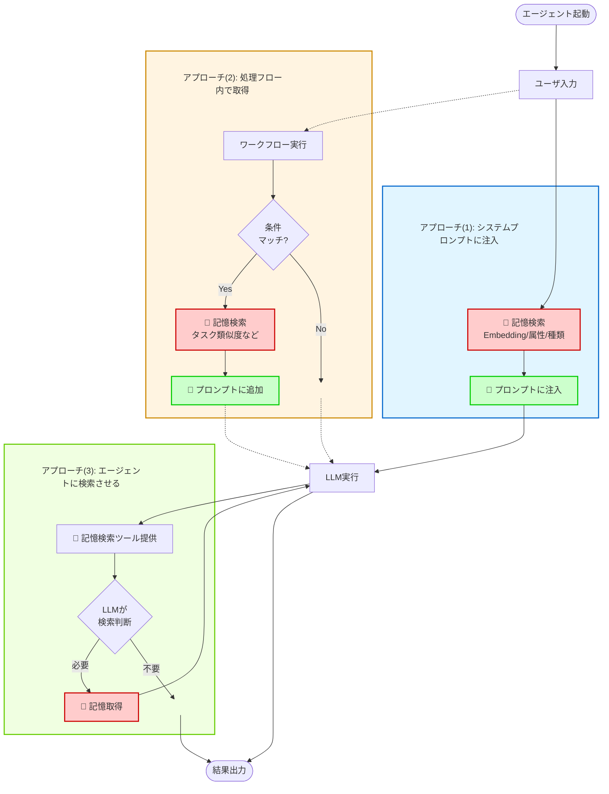

この記事はアドベントカレンダー「[Goで作るセキュリティ分析LLMエージェント](https://adventar.org/calendars/11354)」の21日目です。

- これまでも解説してきた通り、LLMはステートレスであり、かつコンテキストウィンドウ≒与えられるトークンサイズに限界がある
- このためコンテキストウィンドウをうまく使いこなすためのアプローチの一つが「記憶」
- 今回は記憶に関する解説をするが、実は筆者自身もいろいろ試したものの、セキュリティ分析における記憶の使い方の解がいまいちまだ見えていない
- とりあえず執筆時点での技術とこれまで試した記憶に関する手法などの現在地について解説する
- またこれらは執筆時点の2025年12月の知識や概況に基づいている点に注意されたし

# LLMエージェントにおける記憶の整理

- 2025年現在、LLM実行においてユーザ入力以外で外部から取り込むデータの総称
- つまりプロンプトや履歴のようなものも十把一絡げに「記憶」として扱われている
- 明確な定義があるわけではないが、LLMが利用する記憶は短期記憶と長期記憶に分けて考えることが多い
  - 人間を参考にしてる
  - 人間を元にしたモデルは他にもいくつか提案されているが、今のところ実用的なのはまずこの分類と思われる
- 例 LlamaIndexにおけるメモリモデル [^llamaindex-memory]
  - 短期記憶（Short-term Memory、あるいはActive Context）：短期間かつ記憶＝主にセッションの履歴や状態の管理
  - 長期記憶（Long-term Memory、あるいはExternal Archive）：長期的に保存され、必要に応じて呼び出される記憶。RAGが代表格
- また処理の仕方によって事前定義、都度更新のような分類もできる
  - 事前定義（static）
    - RAGのように事前にいろんな文章を突っ込んでおく
    - あるいは実装上のワークフローで定義するプロンプトのようなもの
      - 動的に生成する場合はdynamicに属するような気がする
  - 都度更新（dynamic）
    - 生成AIの行動によって生成されるもの
    - 会話から発生するユーザのプロファイル、エピソード、知見など
- これらの組み合わせで整理するとこういう感じになる

|  | Static（事前定義） | Dynamic（都度更新） |
|---|---|---|
| **Short（短期）** | (1) システムプロンプト、Reasoning Strategies | (2) セッション状態管理[^checkpoint]、履歴、CoT |
| **Long（長期）** | (3) RAG、固定ポリシー、GraphRAG[^graph-rag] | (4) 過去の知見、プロファイル、エピソード |

- (1) 〜 (3) に関してはこれまでも説明してきたし、現時点で（成長の余地もあるが）かなり方法論が確立してきた印象がある
- 問題は(4)でこれはおそらくユースケースにかなり依存するし、まだ各プロダクト・サービスなどが試行錯誤している段階のように感じる

[^checkpoint]: LangChain Short-term memory https://docs.langchain.com/oss/python/langchain/short-term-memory?utm_source=chatgpt.com
[^llamaindex-memory]: Memory in LlamaIndex https://developers.llamaindex.ai/python/examples/memory/memory/
[^graph-rag]: From Local to Global: A Graph RAG Approach to Query-Focused Summarization https://arxiv.org/pdf/2404.16130

# 長期動的記憶（long-dynamic memory）の特性

- 基本的にはセッション（一連の会話）を跨ぐことで嬉しいことを記憶する
- いわゆる一問一答形式のChatだとあまり問題にならない
- ただしメモリ機能はChatGPT、Claude、Geminiでそれぞれ導入済み or 導入中
  - ChatGPTが過去に問題になった4o問題がわかりやすい
  - チャットのセッションをまたいで記憶を引き継ぐ機能があった
    - ChatGPTに人格を「植え付けていた」人たちから反発
- たんなるチャットだと「その人とのエピソード」を散発的に記憶すればいいが、業務によっては覚えてほしい記憶、覚えてほしくない記憶、思い出してほしい記憶、思い出してほしくない記憶というのをうまく制御する必要がある
- この制御はまだいろいろ模索中であるように感じる
- 難しいポイントとしてある程度使い込んでみないとその記憶システムの良し悪しが判断できない
  - 人間の体感による良し悪しがある
  - さらに記憶による影響が自明ではないことが多い
    - そうするとなおさらその記憶が良かったのかどうかわからんとなる
    - ただし明らかに行動は変容するので、それがなくなった瞬間などにわかる（例：4o問題）
  - ということで評価が難しい＝ベンチマークしづらい＝方法が確立しづらい、というのはありそうと感じている
- また長期動的記憶には考えるべき観点が多い

## 何をいつ記憶すべきか？

- 記憶すべき内容は、その業務の目的によって異なる
  - セッション中で明らかになった事実
  - ユーザーから教えられた知見
  - ツール実行時にうまくいったこと
  - ツール実行で失敗したこと、あるいは改善されたこと
- これらの情報で別セッションに持ち越すことで利益になるかを考える
  - 例えば単なるおしゃべり会話だとしたらツール実行の振り返りなんてなんの役にも立たない
  - またシンプルなAPI実行代行のようなものであれば、殆どの場合これも振り返りはいらない
  - しかしツール実行が複雑な業務、例えばBigQueryにクエリ発行してログを分析します、みたいなときはどうだろう？
  - このテーブルのこういうフィールドには〜という形式のデータが入っているぞ、このフィールドは空の場合がある、このフィールドが取りうる値はこのぐらいの範囲だ、このフィールドはキーとして使える、などなど
  - また、組織固有の文化、文脈、体制や最近の状況、活発な事業、などなど変わりゆる情報というのもある
  - もちろんこれらは事前にプロンプトとかツール説明とかにいれておけ、って話もある
    - でもだいたい分析とかしている最中にみんな気づくよね
    - そうすると設定ファイルをいじって編集〜みたいになるけどそういうのまあめんどい
    - ということでエージェント自身が覚えて欲しくなる。これがlong-dynamic memoryの醍醐味
- ただこれはプロンプトの管理などに近しい部分もあり、システム上これらを統合して管理するみたいな仕組みがあってもよい
  - というかむしろそこをどううまくやるのが最適解なのかを模索する必要がある
- さらにいうと「何」を記憶するかをLLMに判断させるか、それとも人間が判断するかっていうのも検討ポイント
  - LLMに判断させることももちろんできる。
    - たとえばセッションの終わりで、「このセッションで有効だったことを最大3つあげろ」みたいにして記憶する
    - それもいいんだが、じゃあ本当に記憶してほしいことをちゃんと記憶したか？ってのは難しい
    - そんなに都合よくLLMが判断してくれない
      - これはプロンプトをチューニングしたり与えるデータを調整したりなど、かなりいろいろと頑張る必要がある
  - 一方人間が指示するって手もある
    - 指示自体は自然言語ですればいい
    - 重要度の判定がLLMに難しかったり、あるいはまだプロンプトが熟れてなくて自動判定が難しいみたいなときはこっちのほうがいいかもしれない
    - LLMベースのコードレビューサービス（[devin](https://devin.ai/)とか[CodeRabbit](https://www.coderabbit.ai)とかがそういう機能を持っている）

## 何をいつ思い出すべきか？

- 記憶する方だけでなく、当然ながら思い出す方法も考えないといけない
  - 記憶を全部乗っけていいかというとまったくそんなことはない
  - 立ちふさがるコンテキストウィンドウ制限の壁
  - なので記憶を大量に持っていたとしてもそれを適切なタイミングで適切な記憶だけを注入するというテクニックが必要になる
  - これについてはもうケースバイケースすぎて一概には言えないが、大きく分類すると3つのアプローチが考えられる

- (1) システムプロンプトなどに注入しちゃうアプローチ
  - まず初期プロンプト（特にシステムプロンプト）に注入してしまうパターン
  - ユーザ入力をEmbeddingして検索するのがいわゆるRAGで、このアプローチに位置する
  - もし他の入力データもセッションの文脈でもつシステムならそれを利用して記憶を取得することもできるし、ソッチのほうが良い場合もある
    - 例えばセキュリティ分析の場合、分析対象となる「アラート」というわかりやすい構造データが存在する
    - その中の一分のデータをEmbeddingして検索したり、属性値と一致するものがないか検索したり、あとはアラートの種類が特定できればその種類に関する記憶というのを引っ張ってこれる
  - あとは記憶となるデータをそのまま全部プロンプトに書くのではなく、ID＋要約だけ記載しておくという手もある
    - これはIDによって記憶を検索するツールを用意しておくことで全文の掲載を回避し、コンテキスト消費を抑えるテクニック
    - ただしLLMが正しく検索してくれる必要があり、これはプロンプトを工夫する必要がある
  - このように単に記憶をプロンプトに入れ込むだけでも様々なアプローチがある
- (2) 処理フローの中に「思い出す」っていうのを挟むアプローチ
  - (1)とにているが、処理フローの中で何か条件にマッチした場合にワークフロー内で記憶を取得し、プロンプトなどに付与する
  - 例で言うとPlan & Executeのような処理で列挙させたタスク名をEmbeddingし、似たような過去のタスクの実行結果振り返りの記憶を探す、みたいなことが考えられる
  - (1)以上に処理が複雑になるし、ちゃんと噛み合うケースは結構少ないかもしれない
- (3) エージェントに思い出させる（検索させる）アプローチ
  - LLMが使えるツールに記憶検索機能を実装しておく
  - これによってLLMが任意に記憶を取得できる
  - 利点としてはID＋要約をいれておく(1)の場合と同じく、コンテキスト消費を大幅に抑えられる
  - 問題はLLMが必要なときに必要な記憶を検索してくれるかどうか
    - 「記憶を検索できますよ」だけだとなかなか検索しなかったり、検索しようとしても期待した検索条件などをいれてくれない
    - 必要に応じて記憶を検索せよ、みたいなことをけっこう強めにプロンプトに書き込んでおく必要がある
    - また、どのような知識が格納されていると期待されるかについてもちゃんと書いておく必要がある。バクっと記憶がありますだけとかはダメ
  - あとはツールの検索方法についてもいろいろアプローチがありえる

## 何をいつ更新する・忘れるべきか？

- 忘れないといけないこともある
  - すべての記憶が有効かというとそういうわけでもない
  - たまたまうまくいった、うまくいかなかったケースがあとから有害になることがある
  - あるいは状況が変わったことでその情報はもう価値がなかったり、間違った情報になっているということもありえる
  - そのため記憶を更新したり・忘れる（つまり記憶の削除）をする必要がある
- どのタイミングでどう更新・削除するか
  - これは極めて難しい
  - 一つタイミングとして考えられるのは、それが間違い・無価値と判明した瞬間
    - 殆どの場合それは何か処理をする過程で発覚する
    - そのためタスク完了時などにその記憶の有用性を評価させるみたいなアプローチはあり得る
- どの記憶を更新・削除するのか
  - これもまた難しい
  - 「役に立った」記憶は評価しやすいが、一方で「役に立たなかった」記憶をどう評価するか
    - 後で役に立つかもしれない
    - その時はたまたまなにか噛み合わなかったのかもしれない
  - 現実的には徐々に評価を落としていくパターン、、、のはずなんだけど実際にそこまで長期運用されたケースはまだまだ世の中に多くないんじゃないか？と
    - このあたりについては今後ベストプラクティスが定まっていく事に期待
  - あと場合によっては人間が直接記憶をいじることができるインターフェースを用意するというのも手段のひとつ
    - 例えばWebUIに記憶編集・削除画面つくるとか
    - 記憶データ（文章とか）なら人間にも理解しやすく管理はしうる
      - ただし「このワークフローで悪さしたのはどれだ」みたいなのを特定するのはちょっと大変かもしれん

# セキュリティ分析における記憶のユースケース

- 今回は実装をのせるに至らないが、記憶に関するセキュリティ分析のユースケースをまとめておく
- (1) 類似アラートの対応記録を呼び出し
  - これはすでに実装したやつ
  - これも一種の記憶管理で、過去の対応記録を元に脅威度の判定をさせる（どちらかといえばfalse positiveであることの根拠に使う）
- (2) 分析方法に関する記憶
  - 特にツール呼び出し系
  - 先述した通り、例えばログの取得というかログを蓄積したDWHへのアクセスではどのフィールドに何が入っていて、それがどう活用できるのか、みたいな知識が必要になる
    - もちろんこれらはスキーマ情報として与えられているのが望ましいが、説明不足であったり行間の補足が必要なものもある
    - それゆえに行動の記録を取得しておくのは一つの効果となる
- (3) 分析環境に関する背景・文脈の記憶
  - 例えば組織特有の情報、監視対象環境のアーキテクチャ、システム運用方法、組織のポリシー、独特なルールなど
  - これも事前にプロンプトに入れておけばいいんだが、管理するのが面倒だし、実際に分析させてみてわかることもある
  - それをいちいちLLMで要約 → コピー → 設定ファイルに投入、みたいなこともできなくもないが、今どきのやり方でやるならもうエージェント内で完結していてほしい

# まとめ

- 明日は記憶機能の実装をしてみます
- 冒頭で述べた通り実績はないんだけどあくまで参考までにということで
